# 🚀 **GLAD Labs AI Frontier Firm - Production Ready Monorepo**


> **AI-driven content creation and publishing platform with autonomous agents managing the full content lifecycle from ideation to publication.**

---

## **🎯 Executive Summary**

GLAD Labs operates as an automated AI-powered content creation firm, featuring specialized agents that autonomously research, create, and publish high-quality content. The system integrates a modern headless CMS (Strapi v5) with a performant Next.js frontend and intelligent Python-based content agents.

**Current Status:** ✅ **Production Ready v2.0**  
**Last Updated:** October 13, 2025  
**Architecture Compliance:** Modern full-stack web application

---

## **🏗️ System Architecture**

The system is designed as a modern full-stack application with clear separation of concerns and automated content workflows.

| Service           | Technology | Port | Status   | URL                     | Description                                                       |
| ----------------- | ---------- | ---- | -------- | ----------------------- | ----------------------------------------------------------------- |
| **Public Site**   | Next.js 14 | 3000 | ✅ Ready | <http://localhost:3000> | High-performance public website with SSG optimization             |
| **Strapi CMS**    | Strapi v5  | 1337 | ✅ Ready | <http://localhost:1337> | Headless API-first CMS for content management                     |
| **Content Agent** | Python     | -    | ✅ Ready | -                       | Autonomous content creation with AI integration                   |
| **Oversight Hub** | React 18   | 3001 | 🚧 Dev   | <http://localhost:3001> | Admin interface for monitoring and controlling content generation |

### **Technology Stack**

```mermaid
graph TB
    A[Next.js Frontend<br/>SSG + API Routes] --> B[Strapi v5 CMS<br/>SQLite Database]
    C[Content Agent<br/>Python + OpenAI] --> B
    D[Oversight Hub<br/>React + Firebase] --> C
    E[Google Cloud<br/>Pub/Sub + Storage] --> C
    F[Pexels API<br/>Image Generation] --> C

    style A fill:#000000
    style B fill:#4945ff
    style C fill:#4caf50
    style D fill:#61dafb
    style E fill:#ffa726
    style F fill:#ff6b6b
```



---

## **⚡ Quick Start**

### **Prerequisites**

- **Node.js:** v20.11.1+
- **Python:** 3.12+
- **Git:** Latest stable

### **Installation & Setup**

1. **Clone the repository:**

   ```bash
   git clone <repository-url>
   cd glad-labs-website
   ```

2. **Install dependencies:**

   ```bash
   # Install root dependencies
   npm install

   # Install frontend dependencies
   cd web/public-site && npm install && cd ../..
   cd web/oversight-hub && npm install && cd ../..

   # Install CMS dependencies
   cd cms/strapi-v5-backend && npm install && cd ../..

   # Install Python dependencies for content agent
   cd src/agents/content_agent && pip install -r requirements.txt && cd ../../..
   ```

3. **Configure environment variables:**

   **Strapi CMS** (`cms/strapi-v5-backend/.env`):

   ```env
   NODE_ENV=development
   APP_KEYS="your-app-keys"
   API_TOKEN_SALT="your-api-token-salt"
   ADMIN_JWT_SECRET="your-admin-jwt-secret"
   TRANSFER_TOKEN_SALT="your-transfer-token-salt"
   JWT_SECRET="your-jwt-secret"
   ```

   **Next.js Frontend** (`web/public-site/.env.local`):

   ```env
   NEXT_PUBLIC_STRAPI_API_URL=http://localhost:1337
   STRAPI_API_TOKEN=your-strapi-api-token
   ```

   **Content Agent** (`src/agents/content_agent/.env`):

   ```env
   OPENAI_API_KEY=your-openai-api-key
   PEXELS_API_KEY=your-pexels-api-key
   STRAPI_API_URL=http://localhost:1337
   STRAPI_API_TOKEN=your-strapi-api-token
   ```

4. **Start the development environment:**

   ```bash
   # Terminal 1: Start Strapi CMS
   cd cms/strapi-v5-backend
   npm run develop

   # Terminal 2: Start Next.js frontend
   cd web/public-site
   npm run dev

   # Terminal 3: Start content agent (optional)
   cd src/agents/content_agent
   python orchestrator.py
   ```

### **Development URLs**

- **Public Site:** <http://localhost:3000>
- **Strapi Admin:** <http://localhost:1337/admin>
- **Strapi API:** <http://localhost:1337/api>

---

## **🔧 Architecture Components**

### **1. Public Site (Next.js Frontend)**

- **Technology:** Next.js 14 with Static Site Generation (SSG)
- **Features:** Server-side rendering, SEO optimization, responsive design
- **API Integration:** Connects to Strapi v5 via REST API
- **Status:** ✅ Production ready with markdown content rendering

**Key Features:**

- Homepage with featured posts and recent content grid
- Individual post pages with full markdown rendering
- Category and tag-based content filtering
- Privacy policy and about pages
- SEO-optimized meta tags and Open Graph support

### **2. Content Management System (Strapi v5)**

- **Technology:** Strapi v5 with SQLite database
- **Features:** Headless CMS, API-first architecture, admin interface
- **Content Types:** Posts, Categories, Tags, Pages
- **Status:** ✅ Production ready with full CRUD operations

**Content Structure:**

- **Posts**: Title, slug, content (markdown), excerpt, featured flag, cover image
- **Categories**: Name, slug, description
- **Tags**: Name, slug
- **Relations**: Posts belong to categories and can have multiple tags

### **3. Content Agent (Autonomous AI)**

- **Technology:** Python with OpenAI GPT integration
- **Features:** Autonomous content creation, image sourcing, quality assurance
- **Workflow:** Research → Create → Review → Publish
- **Status:** ✅ Production ready with multi-agent pipeline

**Agent Pipeline:**

1. **Research Agent**: Gathers context and information
2. **Creative Agent**: Generates initial content drafts
3. **QA Agent**: Reviews content for quality and compliance
4. **Image Agent**: Sources and processes relevant images
5. **Publishing Agent**: Formats and publishes to Strapi

### **4. Oversight Hub (Admin Interface)**

- **Technology:** React 18 with Firebase integration
- **Features:** Real-time monitoring, agent control, chat interface
- **Status:** 🚧 Development phase

---

## **📚 Documentation**

| Document                                             | Description                          | Status     |
| ---------------------------------------------------- | ------------------------------------ | ---------- |
| [SYSTEM_DOCUMENTATION.md](./SYSTEM_DOCUMENTATION.md) | Complete system documentation        | ✅ Current |
| [data_schemas.md](./data_schemas.md)                 | Database and content schemas         | ✅ Current |
| [GLAD-LABS-STANDARDS.md](./GLAD-LABS-STANDARDS.md)   | Development standards and guidelines | ✅ Current |

### **Component Documentation**

- **[Public Site](./web/public-site/README.md)** - Next.js frontend documentation
- **[Strapi CMS](./cms/strapi-v5-backend/README.md)** - Content management system setup
- **[Content Agent](./src/agents/content_agent/README.md)** - Autonomous content creation
- **[Oversight Hub](./web/oversight-hub/README.md)** - Admin interface

---

## **🛠️ Development Workflow**

### **Content Creation Process**

1. **Manual Trigger**: Create content requests via Oversight Hub or direct API
2. **Agent Processing**: Content agent processes request through multi-agent pipeline
3. **Content Generation**: AI generates high-quality, SEO-optimized content
4. **Quality Assurance**: Automated review and refinement process
5. **Publication**: Content published to Strapi and available on public site

### **Code Quality Standards**

- **ESLint**: Frontend code linting and formatting
- **Prettier**: Code formatting consistency
- **React Markdown**: Markdown content rendering
- **Tailwind CSS**: Utility-first styling approach

---

## **🚀 Deployment**

### **Production Considerations**

- **Strapi**: Deploy to cloud hosting with PostgreSQL database
- **Next.js**: Deploy to Vercel, Netlify, or similar static hosting
- **Content Agent**: Deploy to Google Cloud Run or AWS Lambda
- **Environment Variables**: Secure API keys and database credentials

### **Performance Optimizations**

- **Static Site Generation**: Pre-built pages for optimal performance
- **Image Optimization**: Next.js automatic image optimization
- **API Caching**: Strapi content caching strategies
- **CDN Integration**: Global content delivery

---

## **🤝 Contributing**

### **Development Setup**

1. **Fork the repository**
2. **Create feature branch**: `git checkout -b feature/new-capability`
3. **Follow code standards**: ESLint, Prettier, component conventions
4. **Add comprehensive tests**: Unit and integration testing
5. **Update documentation**: Keep all docs current
6. **Create pull request**: Detailed description of changes

### **Testing Strategy**

- **Frontend**: Jest + React Testing Library
- **Backend**: Strapi built-in testing framework
- **Content Agent**: Python unittest framework
- **Integration**: End-to-end testing with Playwright

---

## **📞 Support & Contact**

**Project Owner:** Matthew M. Gladding  
**Organization:** Glad Labs, LLC  
**License:** MIT

**Architecture Status:** ✅ Production Ready v2.0  
**Last Documentation Update:** October 13, 2025
