# 🚀 **GLAD Labs AI Frontier Firm - Production Ready Monorepo**


> **Autonomous AI-driven digital firm with central AI Co-Founder orchestrating specialized agents across a Google-native serverless architecture.**

---

## **🎯 Executive Summary**

GLAD Labs operates as the most efficient, automated, solo-founded digital firm by fusing high-quality content creation with an intelligent **AI Co-Founder** that manages all business operations. The system implements a Google-native stack with real-time data operations, comprehensive performance monitoring, and production-ready deployment configuration.

**Current Status:** ✅ **Production Ready v4.0**  
**Last Updated:** October 11, 2025  
**Architecture Compliance:** GLAD-LABS-STANDARDS.md v4.0

---

## **🏗️ System Architecture**

The system is designed as a decoupled, microservice-oriented architecture with Google Cloud native services, enabling independent development, scaling, and monitoring of each component.

| Service           | Technology     | Port | Status   | URL                     | Description                                                         |
| ----------------- | -------------- | ---- | -------- | ----------------------- | ------------------------------------------------------------------- |
| **AI Co-Founder** | Python FastAPI | 8000 | ✅ Ready | <http://localhost:8000> | Central "big brain" orchestrator managing all agents and operations |
| **Oversight Hub** | React 18       | 3001 | ✅ Ready | <http://localhost:3001> | Real-time command center for monitoring and controlling AI agents   |
| **Public Site**   | Next.js 14     | 3000 | ✅ Ready | <http://localhost:3000> | High-performance public website consuming content from Strapi       |
| **Strapi CMS**    | Strapi v5      | 1337 | ✅ Ready | <http://localhost:1337> | Headless API-first CMS for all content management                   |

### **Google Cloud Native Stack**

```mermaid
graph TB
    A[Oversight Hub<br/>React] --> B[AI Co-Founder<br/>FastAPI]
    C[Public Site<br/>Next.js] --> D[Strapi CMS<br/>v5]
    B --> E[Firestore<br/>Database]
    B --> F[Pub/Sub<br/>Messaging]
    F --> G[Content Agent<br/>Cloud Run]
    G --> D
    E --> H[Performance<br/>Monitoring]

    style A fill:#61dafb
    style B fill:#ff6b6b
    style C fill:#000000
    style D fill:#4945ff
    style E fill:#ffa726
    style F fill:#ffa726
    style G fill:#4caf50
    style H fill:#9c27b0
```



---

## **⚡ Quick Start**

### **Prerequisites**

- **Node.js:** v20.11.1+
- **Python:** 3.12+
- **Git:** Latest stable
- **Google Cloud SDK:** For production deployment
- **VS Code:** Recommended (workspace pre-configured)

### **Installation & Setup**

1. **Clone the repository:**

   ```bash
   git clone <repository-url>
   cd glad-labs-website
   ```

2. **Install dependencies:**

   ```bash
   npm install && pip install -e .
   ```

3. **Configure environment variables:**
   Copy the `.env.example` file in each service directory to a new `.env` file and fill in the required credentials.

   - `src/agents/content_agent/.env`
   - `web/oversight-hub/.env`
   - `web/public-site/.env.local`
   - `cms/strapi-v5-backend/.env`

4. **Start all services in development mode:**

   ```bash
   npm run dev
   ```

### **Development URLs**

- **AI Co-Founder API:** <http://localhost:8000> (+ `/docs` for Swagger)
- **Oversight Hub:** <http://localhost:3001>
- **Public Site:** <http://localhost:3000>
- **Strapi Admin:** <http://localhost:1337/admin>

---

## **🔧 Architecture Components**

### **1. AI Co-Founder Agent (Central Orchestrator)**

- **Technology:** Python FastAPI with Google Cloud integration
- **Features:** Dual async/sync processing, comprehensive monitoring, structured logging
- **API:** RESTful with OpenAPI documentation
- **Status:** ✅ Production ready with performance monitoring

### **2. Specialized Agents**

- **Content Agent:** Autonomous content creation with AI integration.
- **Financial Agent (Planned):** Budget tracking and expense monitoring.
- **Compliance Agent (Planned):** Security audits and code compliance.
- **Market Insight Agent (Planned):** Trend analysis and topic suggestions.

### **3. Frontend Applications**

- **Oversight Hub:** React-based command center with real-time Firebase integration, a chat interface, and a settings page.
- **Public Site:** Next.js with SSG optimization for SEO performance.
- **Both:** Tailwind CSS, responsive design, production-ready.

### **4. Data & Infrastructure**

- **Firestore:** Real-time operational database following structured schemas.
- **Pub/Sub:** Asynchronous agent communication and task queuing.
- **Strapi v5:** Headless CMS with API-first architecture.
- **Performance Monitoring:** Comprehensive metrics and health tracking.

---

## **📚 Documentation**

| Document                                                   | Description                           | Status     |
| ---------------------------------------------------------- | ------------------------------------- | ---------- |
| [SYSTEM_DOCUMENTATION.md](./SYSTEM_DOCUMENTATION.md)       | Complete system documentation         | ✅ Current |
| [GLAD-LABS-STANDARDS.md](./GLAD-LABS-STANDARDS.md)         | Architecture standards and guidelines | ✅ v4.0    |
| [data_schemas.md](./data_schemas.md)                       | Firestore collection schemas          | ✅ v1.1    |
| [IMPLEMENTATION_COMPLETE.md](./IMPLEMENTATION_COMPLETE.md) | Implementation status                 | ✅ Current |

### **Component Documentation**

- **[AI Co-Founder API](./src/cofounder_agent/README.md)** - Central orchestrator documentation
- **[Content Agent](./src/agents/content_agent/README.md)** - Autonomous content creation
- **[Oversight Hub](./web/oversight-hub/README.md)** - Command center interface
- **[Public Site](./web/public-site/README.md)** - Public website and blog

---

## **🛠️ VS Code Workspace**

The project includes a comprehensive VS Code workspace configuration:

```bash
# Open the workspace
code glad-labs-workspace.code-workspace
```

**Features:**

- **Pre-configured Tasks:** Start all services with one command
- **Debugging Setup:** Multi-service debugging configuration
- **Extensions:** Recommended extensions for optimal development
- **Settings:** Unified formatting, linting, and workspace settings

---

## **🤝 Contributing**

### **Development Workflow**

1. **Create Feature Branch:** `git checkout -b feature/new-capability`
2. **Follow Standards:** Ensure compliance with `GLAD-LABS-STANDARDS.md`
3. **Add Tests:** Comprehensive testing for new features
4. **Update Documentation:** Keep documentation current
5. **Create Pull Request:** Detailed description of changes

### **Code Quality Standards**

- **ESLint:** Frontend code linting and formatting
- **Ruff:** Python code formatting and linting
- **Pytest:** Python testing framework
- **Jest:** JavaScript/React testing framework

---

## **📞 Support & Contact**

**Project Owner:** Matthew M. Gladding  
**Organization:** Glad Labs, LLC  
**License:** MIT
