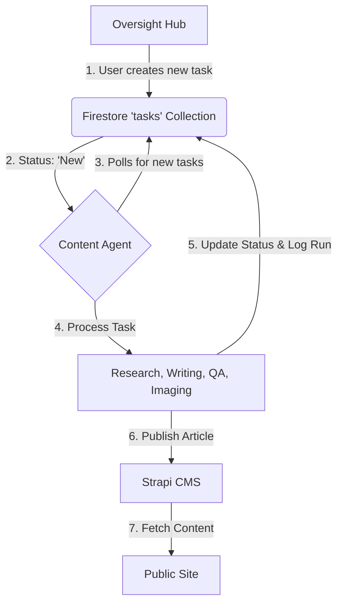

# GLAD Labs Monorepo

This repository contains the complete codebase for the GLAD Labs digital firm, encompassing a headless CMS, a public-facing website, a real-time oversight dashboard, and a sophisticated AI content generation agent.

## 🚀 System Architecture

The system is designed as a decoupled, microservice-oriented architecture, enabling independent development and scaling of each component.

| Service           | Technology    | Port | URL                     | Description                                                   |
| ----------------- | ------------- | ---- | ----------------------- | ------------------------------------------------------------- |
| **Strapi CMS**    | Strapi v4     | 1337 | <http://localhost:1337> | Headless CMS for all content.                                 |
| **Oversight Hub** | React         | 3001 | <http://localhost:3001> | Real-time dashboard for monitoring and managing the AI agent. |
| **Public Site**   | Next.js       | 3002 | <http://localhost:3002> | The public-facing website that consumes content from Strapi.  |
| **Content Agent** | Python/CrewAI | N/A  | (Runs in terminal)      | The AI agent responsible for the entire content lifecycle.    |

---

## Workflow: Content Generation



---

## 🛠️ Getting Started

### Prerequisites

- **Node.js**: Version `20.11.1` is required. Use `nvm` to manage versions (`nvm use`).
- **Python**: Version `3.10` or higher.
- **Google Cloud SDK**: Authenticated with access to Firestore.

### 1. Installation

Clone the repository and install all dependencies for the monorepo workspaces.

```bash
git clone <repository_url>
cd glad-labs-website
npm install
```

### 2. Environment Configuration

Each service requires its own environment file. Copy the `.env.example` file in each service directory to a new file (`.env` or `.env.local`) and fill in the required credentials.

- `agents/content-agent/.env`: Google Cloud Project ID.
- `web/oversight-hub/.env`: Firebase SDK credentials.
- `web/public-site/.env.local`: Strapi API URL and token.

### 3. Launching the System

This workspace is configured to automatically launch all services when opened in VS Code. If you need to start it manually, run the following command from the root directory:

```bash
npm run start:all
```

---

## 🐍 Python Agent Setup

The content agent requires its own Python environment and dependencies.

1. **Navigate to the agent directory:**

   ```bash
   cd agents/content-agent
   ```

2. **Create a virtual environment:**

   ```bash
   python -m venv .venv
   ```

3. **Activate the environment:**
   - **PowerShell:** `.\\.venv\\Scripts\\Activate.ps1`
   - **Bash/Zsh:** `source ./.venv/bin/activate`

4. **Install dependencies:**

   ```bash
   pip install -r requirements.txt
   ```

### Running the Agent

The agent is started as part of the `start:all` command. To run it manually:

```bash
python orchestrator.py
```

### Creating New Tasks

You can create new content tasks in two ways:

1. **Via the Oversight Hub:** Use the "New Task" button in the web interface.
2. **Via the CLI:** Run the `create_task.py` script.

   ```bash
   python create_task.py
   ```
