# 🚀 **GLAD Labs AI Frontier Firm - Production Ready Monorepo**


> **Autonomous AI-driven digital firm with central AI Co-Founder orchestrating specialized agents across a Google-native serverless architecture.**

---

## **🎯 Executive Summary**

GLAD Labs operates as the most efficient, automated, solo-founded digital firm by fusing high-quality content creation with an intelligent **AI Co-Founder** that manages all business operations. The system implements a Google-native stack with real-time data operations, comprehensive performance monitoring, and production-ready deployment configuration.

**Current Status:** ✅ **Production Ready v4.0**  
**Last Updated:** October 9, 2025  
**Architecture Compliance:** GLAD-LABS-STANDARDS.md v4.0

---

## **🏗️ System Architecture**

The system is designed as a decoupled, microservice-oriented architecture with Google Cloud native services, enabling independent development, scaling, and monitoring of each component.

| Service           | Technology     | Port | Status   | URL                     | Description                                                         |
| ----------------- | -------------- | ---- | -------- | ----------------------- | ------------------------------------------------------------------- |
| **AI Co-Founder** | Python FastAPI | 8000 | ✅ Ready | <http://localhost:8000> | Central "big brain" orchestrator managing all agents and operations |
| **Oversight Hub** | React 18       | 3001 | ✅ Ready | <http://localhost:3001> | Real-time command center for monitoring and controlling AI agents   |
| **Public Site**   | Next.js 14     | 3000 | ✅ Ready | <http://localhost:3000> | High-performance public website consuming content from Strapi       |
| **Strapi CMS**    | Strapi v5      | 1337 | ✅ Ready | <http://localhost:1337> | Headless API-first CMS for all content management                   |

### **Google Cloud Native Stack**

```mermaid
graph TB
    A[Oversight Hub<br/>React] --> B[AI Co-Founder<br/>FastAPI]
    C[Public Site<br/>Next.js] --> D[Strapi CMS<br/>v5]
    B --> E[Firestore<br/>Database]
    B --> F[Pub/Sub<br/>Messaging]
    F --> G[Content Agent<br/>Cloud Run]
    G --> D
    E --> H[Performance<br/>Monitoring]

    style A fill:#61dafb
    style B fill:#ff6b6b
    style C fill:#000000
    style D fill:#4945ff
    style E fill:#ffa726
    style F fill:#ffa726
    style G fill:#4caf50
    style H fill:#9c27b0
```



---

## **⚡ Quick Start**

### **Prerequisites**

- **Node.js:** v20.11.1+
- **Python:** 3.12+
- **Git:** Latest stable
- **Google Cloud SDK:** For production deployment
- **VS Code:** Recommended (workspace pre-configured)

### **Installation**

```bash
# 1. Clone and install
git clone <repository-url>
cd glad-labs-website
npm install && pip install -e .

# 2. Environment setup
cp .env.example .env
cp web/oversight-hub/.env.example web/oversight-hub/.env
cp web/public-site/.env.example web/public-site/.env
cp cms/strapi-v5-backend/.env.example cms/strapi-v5-backend/.env

# 3. Start all services
npm run dev
```

### **Development URLs**

- **AI Co-Founder API:** <http://localhost:8000> (+ `/docs` for Swagger)
- **Oversight Hub:** <http://localhost:3001>
- **Public Site:** <http://localhost:3000>
- **Strapi Admin:** <http://localhost:1337/admin>

---

## **🔧 Architecture Components**

### **1. AI Co-Founder Agent (Central Orchestrator)**

- **Technology:** Python FastAPI with Google Cloud integration
- **Features:** Dual async/sync processing, comprehensive monitoring, structured logging
- **API:** RESTful with OpenAPI documentation
- **Status:** ✅ Production ready with performance monitoring

### **2. Specialized Agents**

- **Content Agent:** Autonomous content creation with AI integration
- **Financial Agent:** Budget tracking and expense monitoring
- **Compliance Agent:** Security audits and code compliance
- **Market Insight Agent:** Trend analysis and topic suggestions

### **3. Frontend Applications**

- **Oversight Hub:** React-based command center with real-time Firebase integration
- **Public Site:** Next.js with SSG optimization for SEO performance
- **Both:** Tailwind CSS, responsive design, production-ready

### **4. Data & Infrastructure**

- **Firestore:** Real-time operational database following structured schemas
- **Pub/Sub:** Asynchronous agent communication and task queuing
- **Strapi v5:** Headless CMS with API-first architecture
- **Performance Monitoring:** Comprehensive metrics and health tracking

---

## **📊 Production Features**

### **✅ Google Cloud Native Integration**

- **Firestore:** Real-time database with structured schemas (`data_schemas.md`)
- **Pub/Sub:** Agent messaging and task distribution
- **Cloud Run:** Serverless container deployment
- **Structured Logging:** Production-ready logging with `structlog`

### **✅ Performance Monitoring**

- **Real-time Metrics:** Command processing, database latency, error rates
- **Health Monitoring:** Service status and connectivity tracking
- **Business Analytics:** Content performance, agent utilization, cost tracking

### **✅ Development Experience**

- **VS Code Workspace:** Pre-configured with tasks, debugging, extensions
- **Hot Reloading:** All services support development mode
- **Comprehensive Testing:** Jest, pytest, ESLint integration
- **CI/CD Pipeline:** GitLab CI with multi-stage testing and deployment

### **✅ Security & Compliance**

- **Environment Variables:** Secure credential management
- **CORS Configuration:** Restricted origins for security
- **Input Validation:** Pydantic models for API security
- **Error Handling:** Secure error messages without data leakage

---

## **🛠️ Development Commands**

### **Individual Services**

```bash
# AI Co-Founder (FastAPI)
npm run dev:cofounder         # Start on port 8000

# Oversight Hub (React)
npm run dev:hub               # Start on port 3001

# Public Site (Next.js)
npm run dev:public            # Start on port 3000

# Strapi CMS
npm run dev:strapi            # Start on port 1337
```

### **Quality & Testing**

```bash
# Linting and formatting
npm run lint                  # Lint all projects
npm run lint:fix             # Auto-fix linting issues

# Testing
npm run test                 # Run all tests
npm run test:frontend        # Frontend tests only
npm run test:python          # Python tests only

# Clean and rebuild
npm run clean               # Clean all dependencies
npm run install:clean       # Clean install all packages
```

### **Production**

```bash
# Build for production
npm run build               # Build all services

# Production deployment
npm run deploy              # Deploy to Google Cloud (requires setup)
```

---

## **🚀 Production Deployment**

### **Google Cloud Setup**

```bash
# 1. Create project and enable APIs
gcloud projects create glad-labs-production
gcloud services enable firestore.googleapis.com pubsub.googleapis.com run.googleapis.com

# 2. Configure Firestore
gcloud firestore databases create --region=us-central1

# 3. Create Pub/Sub topics
gcloud pubsub topics create content-creation-requests

# 4. Deploy services
npm run deploy:production
```

### **Environment Configuration**

See individual service `.env.example` files for complete configuration options.

**Key Variables:**

- `GCP_PROJECT_ID`: Google Cloud project identifier
- `FIRESTORE_DATABASE`: Database name (default: "(default)")
- `PUBSUB_TOPIC_CONTENT`: Content creation topic name

---

## **📈 Monitoring & Observability**

### **Performance Metrics**

- **API Response Times:** Average, min, max processing times
- **Database Operations:** Firestore read/write latencies
- **Agent Performance:** Task completion rates and processing times
- **Resource Usage:** Memory, CPU utilization across services

### **Business Intelligence**

- **Content Analytics:** Post performance, engagement rates
- **Financial Tracking:** Cloud spend, burn rate monitoring
- **Operational Efficiency:** Agent utilization, task throughput

### **Health Checks**

- **Service Status:** Real-time connectivity monitoring
- **Error Tracking:** Comprehensive error rates and patterns
- **Performance Alerts:** Automated alerting for critical thresholds

---

## **🔒 Security & Compliance**

### **Security Measures**

- **Authentication:** Google Cloud service account integration
- **Data Protection:** HTTPS everywhere, encrypted data in transit
- **Access Control:** IAM policies with principle of least privilege
- **Input Validation:** Comprehensive request validation with Pydantic

### **Compliance Standards**

- **OWASP Guidelines:** Web application security best practices
- **Google Cloud Security:** Native cloud security controls
- **Data Privacy:** GDPR considerations for user data
- **Audit Logging:** Comprehensive activity tracking

---

## **📚 Documentation**

| Document                                                   | Description                           | Status     |
| ---------------------------------------------------------- | ------------------------------------- | ---------- |
| [SYSTEM_DOCUMENTATION.md](./SYSTEM_DOCUMENTATION.md)       | Complete system documentation         | ✅ Current |
| [GLAD-LABS-STANDARDS.md](./GLAD-LABS-STANDARDS.md)         | Architecture standards and guidelines | ✅ v4.0    |
| [data_schemas.md](./data_schemas.md)                       | Firestore collection schemas          | ✅ v1.1    |
| [IMPLEMENTATION_COMPLETE.md](./IMPLEMENTATION_COMPLETE.md) | Implementation status                 | ✅ Current |

### **Component Documentation**

- **[AI Co-Founder API](./src/cofounder_agent/README.md)** - Central orchestrator documentation
- **[Content Agent](./src/agents/content_agent/README.md)** - Autonomous content creation
- **[Oversight Hub](./web/oversight-hub/README.md)** - Command center interface
- **[Public Site](./web/public-site/README.md)** - Public website and blog

---

## **🛠️ VS Code Workspace**

The project includes a comprehensive VS Code workspace configuration:

```bash
# Open the workspace
code glad-labs-workspace.code-workspace
```

**Features:**

- **Pre-configured Tasks:** Start all services with one command
- **Debugging Setup:** Multi-service debugging configuration
- **Extensions:** Recommended extensions for optimal development
- **Settings:** Unified formatting, linting, and workspace settings

---

## **🤝 Contributing**

### **Development Workflow**

1. **Create Feature Branch:** `git checkout -b feature/new-capability`
2. **Follow Standards:** Ensure compliance with `GLAD-LABS-STANDARDS.md`
3. **Add Tests:** Comprehensive testing for new features
4. **Update Documentation:** Keep documentation current
5. **Create Pull Request:** Detailed description of changes

### **Code Quality Standards**

- **ESLint:** Frontend code linting and formatting
- **Ruff:** Python code formatting and linting
- **Pytest:** Python testing framework
- **Jest:** JavaScript/React testing framework

---

## **📞 Support & Contact**

**Project Owner:** Matthew M. Gladding  
**Organization:** Glad Labs, LLC  
**License:** MIT

**Documentation Maintained By:** GLAD Labs Development Team  
**Last Review:** October 9, 2025  
**Next Review:** November 9, 2025

---

## **🏆 Project Status**

### **✅ Completed (Production Ready)**

- Central AI Co-Founder with Google Cloud integration
- Real-time Oversight Hub with Firebase connectivity
- High-performance public site with Next.js SSG
- Comprehensive performance monitoring and health tracking
- Production-ready deployment configuration
- Complete documentation and operational procedures

### **🔄 In Progress (Q4 2025)**

- Advanced AI capabilities integration
- Multi-tenant SaaS packaging preparation
- Enhanced security audit and compliance
- Load testing and performance optimization

### **📋 Planned (Q1 2026)**

- Enterprise-grade features and scaling
- Advanced automation and self-healing capabilities
- Comprehensive integration testing suite
- Advanced business intelligence and analytics

---

**Status:** ✅ **Production Ready v4.0** - Fully operational with Google Cloud native architecture

## 🚀 System Architecture

The system is designed as a decoupled, microservice-oriented architecture, enabling independent development and scaling of each component.

| Service              | Technology     | Port | URL                     | Description                                                    |
| -------------------- | -------------- | ---- | ----------------------- | -------------------------------------------------------------- |
| **Strapi CMS**       | Strapi v5      | 1337 | <http://localhost:1337> | Headless CMS for all content.                                  |
| **Oversight Hub**    | React          | 3001 | <http://localhost:3001> | Real-time dashboard for monitoring and managing the AI agents. |
| **Public Site**      | Next.js        | 3000 | <http://localhost:3000> | The public-facing website that consumes content from Strapi.   |
| **Co-Founder Agent** | Python/FastAPI | 8000 | <http://localhost:8000> | The central "big brain" AI that manages all other agents.      |

---

### VS Code Workspace

This repository includes a [VS Code Workspace file](glad-labs-workspace.code-workspace) that pre-configures the recommended extensions and settings for this project. To use it, open the repository in VS Code and, when prompted, choose to "Open Workspace".

---

## 🛠️ Getting Started

### Prerequisites

- **Node.js**: Version `20.11.1` or higher is recommended. Use `nvm` to manage versions (`nvm use`).
- **Python**: Version `3.10` or higher.
- **Google Cloud SDK**: Authenticated with access to Firestore.

### 1. Installation

Clone the repository and install all dependencies for the monorepo workspaces.
This command will install all Node.js dependencies for the Strapi CMS, Oversight Hub, and Public Site.

```bash
git clone <repository_url>
cd glad-labs-website
npm install
```

### 2. Python Environment Setup

The Python agents require a virtual environment and an editable installation of the project's Python packages.

1. **From the project root, create and activate the virtual environment:**

   ```bash
   python -m venv .venv
   ```

   - **PowerShell:** `.\\.venv\\Scripts\\Activate.ps1`
   - **Bash/Zsh:** `source ./.venv/bin/activate`

2. **Install the project in editable mode:**
   This makes all agent code importable across the project.

   ```bash
   pip install -e .
   ```

### 3. Environment Configuration

Each service requires its own environment file. Copy the `.env.example` file in each service directory to a new file (`.env` or `.env.local`) and fill in the required credentials.

- `src/agents/content_agent/.env`: Google Cloud Project ID, Pexels API key, etc.
- `web/oversight-hub/.env`: Firebase SDK credentials.
- `web/public-site/.env.local`: Strapi API URL.
- `cms/strapi-v5-backend/.env`: Strapi database and security credentials.

**Co-Founder Agent LLM Configuration:**
The Co-Founder agent's LLM usage can be configured via environment variables in its `.env` file (e.g., `src/cofounder_agent/.env`). This allows you to switch between local models (`ollama`) for development and powerful cloud models (`gemini`) for production.

- `PARSING_LLM_PROVIDER`: Model for understanding commands (default: `ollama`).
- `INSIGHTS_LLM_PROVIDER`: Model for generating ideas (default: `ollama`).
- `CONTENT_LLM_PROVIDER`: Model for writing final content (default: `gemini`).

### 4. Launching the System

You can launch all services (web frontends, Strapi backend, and the AI Co-Founder) simultaneously using a single command from the root directory.

```bash
npm run start:all
```

---

### Creating New Tasks

You can create new content tasks in two ways:

1. **Via the Oversight Hub:** Use the "New Task" button in the web interface.
2. **Via the CLI:** Run the `create_task.py` script.

   ```bash
   python src/agents/content_agent/create_task.py
   ```
