# 🚀 **GLAD Labs AI Co-Founder: Production Ready System Documentation**

## **🎯 System Overview**

GLAD Labs operates as a fully autonomous AI-driven digital firm, orchestrated by a central AI Co-Founder that manages specialized agents across a Google-native serverless architecture. This documentation provides comprehensive technical specifications, deployment guidelines, and operational procedures for production environments.

**Last Updated:** October 11, 2025  
**Version:** 4.0 Production Ready  
**Compliance:** GLAD-LABS-STANDARDS.md v4.0

---

## **📋 Table of Contents**

1. [Architecture Overview](#architecture-overview)
2. [Core Services](#core-services)
3. [Data Management](#data-management)
4. [Development & Deployment](#development--deployment)
5. [Monitoring and Performance](#monitoring-and-performance)
6. [Security and Compliance](#security-and-compliance)

---

## Architecture Overview

### **System Architecture Diagram**

```mermaid
graph TB
    A[Oversight Hub<br/>React] --> B[AI Co-Founder<br/>FastAPI]
    C[Public Site<br/>Next.js] --> D[Strapi CMS<br/>v5]
    B --> E[Firestore<br/>Database]
    B --> F[Pub/Sub<br/>Messaging]
    F --> G[Content Agent<br/>Cloud Run]
    G --> D
    E --> H[Performance<br/>Monitoring]

    style A fill:#61dafb
    style B fill:#ff6b6b
    style C fill:#000000
    style D fill:#4945ff
    style E fill:#ffa726
    style F fill:#ffa726
    style G fill:#4caf50
    style H fill:#9c27b0
```

### **Technology Stack Compliance**

✅ **Google-Native Stack**: Firestore, Pub/Sub, Cloud Run ready  
✅ **Serverless Architecture**: Pay-per-use, auto-scaling design  
✅ **Monorepo Structure**: Centralized code management  
✅ **API-First Design**: Headless CMS with structured content  
✅ **Real-Time Operations**: Live data synchronization  
✅ **Performance Monitoring**: Comprehensive metrics tracking

---

## Core Services

### **1. AI Co-Founder Agent (Central Orchestrator)**

**Location:** `/src/cofounder_agent/`  
**Technology:** Python FastAPI  
**Status:** ✅ Production Ready

For more details, see the [AI Co-Founder README.md](./src/cofounder_agent/README.md).

### **2. Oversight Hub (Command Center)**

**Location:** `/web/oversight-hub/`  
**Technology:** React 18 with Create React App  
**Status:** ✅ Production Ready

#### **Key Features — Oversight Hub:**

- **Dual-Pane Interface**: Data visualization + Command interface
- **Real-Time Firebase Integration**: Live data synchronization
- **Responsive Design**: Tailwind CSS with modern UI components
- **Chat Interface**: Conversational command processing in `CommandPane.jsx`
- **Financial Dashboard (Planned):** Budget tracking and operational metrics

For more details, see the [Oversight Hub README.md](./web/oversight-hub/README.md).

### **3. Public Site (Marketing & Content)**

**Location:** `/web/public-site/`  
**Technology:** Next.js 14 with SSG  
**Status:** ✅ Production Ready

For more details, see the [Public Site README.md](./web/public-site/README.md).

### **4. Content Management System**

**Location:** `/cms/strapi-v5-backend/`  
**Technology:** Strapi v5  
**Status:** ✅ Production Ready

For more details, see the [Strapi CMS README.md](./cms/strapi-v5-backend/README.md).

### **5. Content Agent (Autonomous Content Creation)**

**Location:** `/src/agents/content_agent/`  
**Technology:** Python with AI integration  
**Status:** ✅ Production Ready

For more details, see the [Content Agent README.md](./src/agents/content_agent/README.md).

---

## Data Management

For details on the Firestore collections schema, see [data_schemas.md](./data_schemas.md).

---

## Development & Deployment

For detailed instructions on setting up the development environment and deploying the application, please refer to the main [project README.md](./README.md).

---

## Monitoring and Performance

For details on performance metrics, monitoring endpoints, and alerting, please refer to the [AI Co-Founder README.md](./src/cofounder_agent/README.md).

---

## Security and Compliance

For details on security measures and compliance standards, please refer to the [AI Co-Founder README.md](./src/cofounder_agent/README.md).

---

**Documentation maintained by:** GLAD Labs Development Team  
**Contact:** [Contact Information]  
**Last Review:** October 11, 2025  
**Next Review:** November 11, 2025
