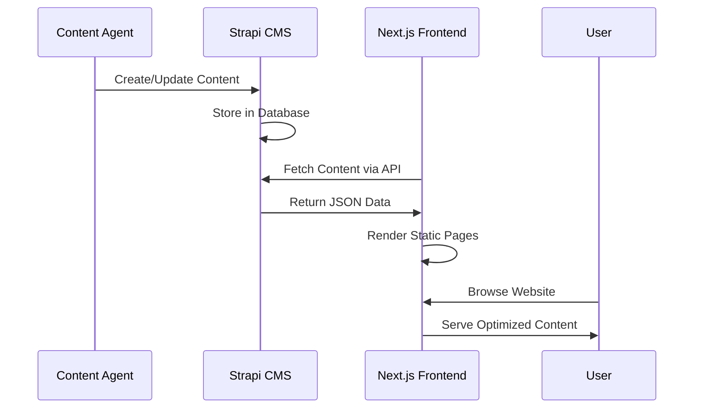

# 🚀 **GLAD Labs AI Content Platform: Production Ready System Documentation**

## **🎯 System Overview**

GLAD Labs operates as an AI-driven content creation and publishing platform, featuring autonomous agents that research, create, and publish high-quality content through a modern headless CMS architecture. This documentation provides comprehensive technical specifications, deployment guidelines, and operational procedures for production environments.

**Last Updated:** October 13, 2025  
**Version:** 2.0 Production Ready  
**Architecture:** Modern Full-Stack Web Application

---

## **📋 Table of Contents**

1. [Architecture Overview](#architecture-overview)
2. [Core Services](#core-services)
3. [Data Management](#data-management)
4. [Development & Deployment](#development--deployment)
5. [API Documentation](#api-documentation)
6. [Security and Compliance](#security-and-compliance)

---

## Architecture Overview

### **System Architecture Diagram**

```mermaid
graph TB
    A[Next.js Frontend<br/>SSG + API Routes] --> B[Strapi v5 CMS<br/>SQLite Database]
    C[Content Agent<br/>Python + OpenAI] --> B
    D[Oversight Hub<br/>React + Firebase] --> C
    E[Google Cloud<br/>Pub/Sub + Storage] --> C
    F[Pexels API<br/>Image Generation] --> C

    style A fill:#000000
    style B fill:#4945ff
    style C fill:#4caf50
    style D fill:#61dafb
    style E fill:#ffa726
    style F fill:#ff6b6b
```



### **Technology Stack Compliance**

✅ **Modern Frontend**: Next.js 14 with SSG optimization  
✅ **Headless CMS**: Strapi v5 with API-first architecture  
✅ **AI Integration**: OpenAI GPT for content generation  
✅ **Image Processing**: Pexels API and Google Cloud Storage  
✅ **Real-Time Data**: Firebase for admin interfaces  
✅ **Performance**: React Markdown with optimized rendering

---

## Core Services

### **1. Public Site (Next.js Frontend)**

**Location:** `/web/public-site/`  
**Technology:** Next.js 14 with Static Site Generation  
**Status:** ✅ Production Ready

#### **Key Features — Public Site:**

- **Static Site Generation**: Pre-built pages for optimal performance
- **Markdown Rendering**: React Markdown for content display
- **SEO Optimization**: Meta tags, Open Graph, and structured data
- **Responsive Design**: Tailwind CSS with mobile-first approach
- **API Integration**: Strapi v5 REST API consumption

#### **Component Architecture:**

- **Pages**: Homepage, post details, category/tag filtering, about/privacy
- **Components**: PostCard, PostList, Header, Layout, FeaturedPost
- **API Helpers**: Centralized Strapi API communication (`lib/api.js`)
- **Styling**: Tailwind CSS with typography plugin

For more details, see the [Public Site README.md](./web/public-site/README.md).

### **2. Content Management System (Strapi v5)**

**Location:** `/cms/strapi-v5-backend/`  
**Technology:** Strapi v5 with SQLite Database  
**Status:** ✅ Production Ready

#### **Key Features — Strapi CMS:**

- **Headless Architecture**: API-first content management
- **Content Types**: Posts, Categories, Tags, Pages
- **Admin Interface**: User-friendly content creation interface
- **API Generation**: Automatic REST API generation
- **Media Management**: File upload and management system

#### **Content Structure:**

- **Posts**: Title, slug, content (markdown), excerpt, featured flag, cover image, category, tags
- **Categories**: Name, slug, description for content organization
- **Tags**: Name, slug for content tagging and filtering
- **Relations**: One-to-many category, many-to-many tags

For more details, see the [Strapi CMS README.md](./cms/strapi-v5-backend/README.md).

### **3. Content Agent (Autonomous AI)**

**Location:** `/src/agents/content_agent/`  
**Technology:** Python with AI integration  
**Status:** ✅ Production Ready

#### **Key Features — Content Agent:**

- **Multi-Agent Pipeline**: Specialized agents for each content creation phase
- **AI Integration**: OpenAI GPT for content generation and review
- **Image Processing**: Pexels API integration for relevant images
- **Quality Assurance**: Automated content review and refinement
- **Publishing Automation**: Direct integration with Strapi CMS

#### **Agent Workflow:**

1. **Research Agent**: Gathers context and background information
2. **Creative Agent**: Generates initial content drafts using AI
3. **QA Agent**: Reviews content for quality, accuracy, and compliance
4. **Image Agent**: Sources and processes relevant images from Pexels
5. **Publishing Agent**: Formats content and publishes to Strapi

For more details, see the [Content Agent README.md](./src/agents/content_agent/README.md).

### **4. Oversight Hub (Admin Interface)**

**Location:** `/web/oversight-hub/`  
**Technology:** React 18 with Firebase  
**Status:** 🚧 Development Phase

#### **Key Features — Oversight Hub:**

- **Real-Time Monitoring**: Live tracking of content generation processes
- **Agent Control**: Start, stop, and configure content agent workflows
- **Chat Interface**: Conversational command processing
- **Settings Management**: Configuration of AI parameters and preferences
- **Financial Dashboard**: Budget tracking and operational metrics (planned)

For more details, see the [Oversight Hub README.md](./web/oversight-hub/README.md).

---

## Data Management

### **Content Storage Architecture**

- **Primary Storage**: Strapi v5 with SQLite database (development) / PostgreSQL (production)
- **Media Storage**: Local filesystem (development) / Cloud storage (production)
- **Image Processing**: Pexels API for sourcing, Google Cloud Storage for hosting
- **Content Format**: Markdown for rich text content with metadata

### **API Architecture**

- **REST API**: Strapi v5 automatically generates REST endpoints
- **Content Filtering**: Support for category, tag, and search filtering
- **Pagination**: Built-in pagination for large content collections
- **Authentication**: API token-based authentication for content management

### **Data Flow**



For detailed schema information, see [data_schemas.md](./data_schemas.md).

---

## Development & Deployment

### **Development Environment Setup**

1. **Prerequisites**: Node.js 20+, Python 3.12+
2. **Installation**: Run `npm install` in root and each service directory
3. **Configuration**: Set up environment variables for each service
4. **Database**: SQLite for development, PostgreSQL for production
5. **Services**: Start Strapi, Next.js, and Content Agent independently

### **Production Deployment Architecture**

- **Frontend**: Deploy Next.js to Vercel, Netlify, or similar platform
- **CMS**: Deploy Strapi to cloud hosting (Railway, DigitalOcean, AWS)
- **Database**: PostgreSQL on managed service (Supabase, AWS RDS)
- **Content Agent**: Deploy to Google Cloud Run or AWS Lambda
- **Media**: Use cloud storage (AWS S3, Google Cloud Storage)

### **Environment Configuration**

```env
# Strapi CMS
NODE_ENV=production
DATABASE_URL=postgresql://...
APP_KEYS=secure-app-keys
JWT_SECRET=secure-jwt-secret

# Next.js Frontend
NEXT_PUBLIC_STRAPI_API_URL=https://api.yourdomain.com
STRAPI_API_TOKEN=your-api-token

# Content Agent
OPENAI_API_KEY=your-openai-key
PEXELS_API_KEY=your-pexels-key
STRAPI_API_URL=https://api.yourdomain.com
```

---

## Content Creation Workflow

### **Automated Content Pipeline**

1. **Trigger**: Manual request or scheduled automation
2. **Research**: Agent gathers context and background information
3. **Generation**: AI creates high-quality, SEO-optimized content
4. **Review**: Automated quality assurance and refinement
5. **Images**: Source and process relevant visual content
6. **Publishing**: Format and publish to Strapi CMS
7. **Distribution**: Content automatically available on public site

### **Quality Assurance Process**

- **Content Review**: AI-powered quality assessment
- **SEO Optimization**: Keyword integration and meta tag generation
- **Brand Compliance**: Tone and style consistency checking
- **Technical Validation**: Markdown formatting and link verification

---

## Security and Compliance

### **Authentication & Authorization**

- **API Security**: Token-based authentication for all API endpoints
- **Admin Access**: Secure admin interfaces with role-based permissions
- **Environment Variables**: Secure storage of API keys and secrets
- **HTTPS**: Encrypted communication for all production services

### **Data Protection**

- **Content Backup**: Regular database backups and version control
- **Media Security**: Secure image storage and delivery
- **Access Logging**: Comprehensive audit trails for content operations
- **Privacy Compliance**: GDPR-compliant data handling practices

---

**Documentation maintained by:** GLAD Labs Development Team  
**Contact:** Matthew M. Gladding (Glad Labs, LLC)  
**Last Review:** October 13, 2025  
**Next Review:** November 13, 2025
