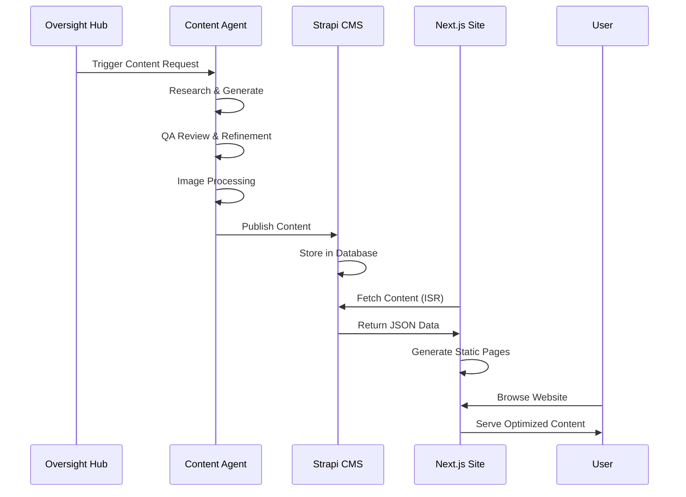

# 🏗️ **GLAD Labs Platform Architecture v2.0**


> **Comprehensive architectural overview of the GLAD Labs AI-powered content platform, detailing component interactions, data flows, and deployment strategies.**

---

## **🎯 Executive Architecture Summary**

The GLAD Labs platform is a modern full-stack web application that combines AI-powered content generation with a high-performance content delivery system. The architecture emphasizes automation, scalability, and maintainability through clear separation of concerns and well-defined interfaces.

**Architecture Principles:**

- **API-First Design**: Headless CMS with RESTful APIs
- **Static Site Generation**: Optimal performance through pre-built pages
- **AI Automation**: Autonomous content creation and management
- **Component Modularity**: Reusable, testable components
- **Production Ready**: Scalable, secure, and monitorable

---

## **🔧 System Components**

### **Frontend Layer**

#### **Next.js Public Site** (`web/public-site/`)

- **Purpose**: Public-facing website and blog
- **Technology**: Next.js 14 with Static Site Generation
- **Port**: 3000
- **Status**: ✅ Production Ready

**Key Features:**

- Homepage with featured posts and content grid
- Individual post pages with full markdown rendering
- Category and tag-based content filtering
- SEO optimization with meta tags and Open Graph
- Responsive design with Tailwind CSS

#### **Oversight Hub** (`web/oversight-hub/`)

- **Purpose**: Admin interface for content agent management
- **Technology**: React 18 with Firebase integration
- **Port**: 3001
- **Status**: 🚧 Development Phase

**Key Features:**

- Real-time monitoring of content generation processes
- Agent control and configuration interface
- Task management and progress tracking
- Chat interface for conversational commands

### **Backend Layer**

#### **Strapi v5 CMS** (`cms/strapi-v5-backend/`)

- **Purpose**: Headless content management system
- **Technology**: Strapi v5 with SQLite/PostgreSQL
- **Port**: 1337
- **Status**: ✅ Production Ready

**Key Features:**

- Content types: Posts, Categories, Tags, Pages
- Automatic REST API generation
- Admin interface for content management
- Media library for image and file management
- Role-based permissions and API authentication

#### **Content Agent** (`src/agents/content_agent/`)

- **Purpose**: Autonomous AI content creation
- **Technology**: Python with OpenAI GPT integration
- **Port**: N/A (event-driven)
- **Status**: ✅ Production Ready

**Key Features:**

- Multi-agent pipeline for content creation
- Quality assurance and refinement loops
- Image sourcing and processing
- Automatic publishing to Strapi CMS

---

## **🔄 Data Flow Architecture**

### **Content Creation Flow**



### **API Integration Points**

```mermaid
graph TD
    A[Next.js Frontend] -->|REST API| B[Strapi v5 CMS]
    C[Content Agent] -->|REST API| B
    D[Oversight Hub] -->|Firebase| E[Cloud Database]
    C -->|Logging| E
    C -->|Images| F[Pexels API]
    C -->|AI| G[OpenAI GPT]

    style A fill:#000000
    style B fill:#4945ff
    style C fill:#4caf50
    style D fill:#61dafb
    style E fill:#ffa726
    style F fill:#ff6b6b
    style G fill:#10a37f
```



---

## **📊 Data Architecture**

### **Content Data Model**

#### **Primary Entities**

1. **Posts**: Blog articles with markdown content
2. **Categories**: Content organization taxonomy
3. **Tags**: Flexible content labeling system
4. **Pages**: Static content pages

#### **Relationships**

- Posts **belong to** one Category
- Posts **have many** Tags (many-to-many)
- Categories **have many** Posts
- Tags **belong to many** Posts

### **Database Schema**

```sql
-- Strapi v5 Structure (SQLite/PostgreSQL)
posts (
  id INTEGER PRIMARY KEY,
  document_id VARCHAR UNIQUE,
  title VARCHAR NOT NULL,
  slug VARCHAR UNIQUE NOT NULL,
  content TEXT,
  excerpt TEXT,
  featured BOOLEAN DEFAULT FALSE,
  created_at TIMESTAMP,
  updated_at TIMESTAMP,
  published_at TIMESTAMP
)

categories (
  id INTEGER PRIMARY KEY,
  name VARCHAR NOT NULL,
  slug VARCHAR UNIQUE NOT NULL
)

tags (
  id INTEGER PRIMARY KEY,
  name VARCHAR NOT NULL,
  slug VARCHAR UNIQUE NOT NULL
)

-- Relationship tables
posts_categories_links (post_id, category_id)
posts_tags_links (post_id, tag_id)
```

### **API Response Structure**

```json
{
  "data": [
    {
      "id": 16,
      "title": "Post Title",
      "slug": "post-slug",
      "content": "# Markdown content...",
      "excerpt": "Post summary...",
      "featured": true,
      "category": {
        "id": 4,
        "name": "Category Name",
        "slug": "category-slug"
      },
      "tags": [
        {
          "id": 8,
          "name": "Tag Name",
          "slug": "tag-slug"
        }
      ],
      "publishedAt": "2025-10-13T05:01:13.062Z"
    }
  ],
  "meta": {
    "pagination": {
      "page": 1,
      "pageSize": 25,
      "total": 5
    }
  }
}
```

---

## **🔐 Security Architecture**

### **Authentication & Authorization**

- **Strapi Admin**: JWT-based admin authentication
- **API Access**: Bearer token authentication for external applications
- **CORS Configuration**: Restricted cross-origin requests
- **Environment Security**: API keys and secrets in environment variables

### **Data Protection**

- **Input Validation**: Comprehensive input sanitization
- **SQL Injection Protection**: ORM-based database queries
- **XSS Prevention**: Content sanitization and output encoding
- **HTTPS Enforcement**: Encrypted communication in production

### **Access Control**

```yaml
Public API:
  - Read access to published content
  - No authentication required
  - Rate limiting applied

Admin API:
  - Full CRUD operations
  - JWT authentication required
  - Role-based permissions

Content Agent API:
  - Create/update permissions
  - API token authentication
  - Restricted to content operations
```

---

## **⚡ Performance Architecture**

### **Frontend Performance**

- **Static Site Generation**: Pre-built pages for instant loading
- **Incremental Static Regeneration**: Content updates without full rebuilds
- **Image Optimization**: Next.js automatic image optimization and lazy loading
- **Code Splitting**: Route-based automatic code splitting
- **CDN Integration**: Global content delivery network support

### **Backend Performance**

- **Database Optimization**: Indexed queries and efficient schema design
- **API Caching**: Strapi built-in caching mechanisms
- **Media Optimization**: Responsive image generation and delivery
- **Query Optimization**: Efficient relationship queries with populate

### **Monitoring & Observability**

```yaml
Application Metrics:
  - Response times and throughput
  - Error rates and success metrics
  - Database query performance
  - API endpoint usage patterns

Business Metrics:
  - Content generation success rates
  - Quality assurance scores
  - Publishing frequency and timing
  - User engagement and traffic patterns

System Health:
  - Server resource utilization
  - Database connection health
  - External API availability
  - Service dependency status
```

---

## **🚀 Deployment Architecture**

### **Development Environment**

```yaml
Local Development:
  - Strapi v5: SQLite database on localhost:1337
  - Next.js: Development server on localhost:3000
  - Content Agent: Python process with local execution
  - Oversight Hub: React dev server on localhost:3001

Dependencies:
  - Node.js 20.11.1+
  - Python 3.12+
  - Environment variables configured locally
```

### **Production Deployment**

```yaml
Recommended Production Stack:
  - Frontend: Vercel or Netlify for Next.js
  - CMS: Railway or DigitalOcean for Strapi
  - Database: PostgreSQL on managed service
  - Content Agent: Google Cloud Run or AWS Lambda
  - Media Storage: AWS S3 or Google Cloud Storage
  - Monitoring: DataDog, New Relic, or Google Cloud Monitoring

Infrastructure Requirements:
  - SSL certificates for all services
  - Environment variable management
  - Database backup and recovery
  - CI/CD pipeline for automated deployment
```

### **Scaling Considerations**

- **Horizontal Scaling**: Multiple Strapi instances behind load balancer
- **Database Scaling**: Read replicas for content distribution
- **CDN Integration**: Global content delivery for static assets
- **Caching Strategy**: Redis for API response caching
- **Content Agent Scaling**: Serverless functions for demand-based scaling

---

## **📈 Operational Excellence**

### **Monitoring Strategy**

1. **Application Performance**: Response times, error rates, throughput
2. **Content Quality**: QA scores, refinement cycles, success rates
3. **Business Metrics**: Content publishing frequency, engagement rates
4. **Infrastructure Health**: Server resources, database performance

### **Backup & Recovery**

1. **Database Backups**: Automated daily backups with point-in-time recovery
2. **Media Backups**: Cloud storage with versioning and redundancy
3. **Code Repository**: Git with comprehensive version control
4. **Configuration Management**: Environment variable backup and recovery

### **Maintenance Procedures**

1. **Dependency Updates**: Regular security and feature updates
2. **Performance Optimization**: Ongoing performance monitoring and tuning
3. **Content Auditing**: Periodic review of generated content quality
4. **Security Updates**: Regular security patches and vulnerability assessments

---

## **🔮 Future Architecture Evolution**

### **Planned Enhancements**

1. **Microservices Migration**: Break down monolithic components
2. **Event-Driven Architecture**: Pub/Sub for all inter-service communication
3. **Vector Database Integration**: Content similarity and recommendation engine
4. **Multi-language Support**: Internationalization and localization
5. **Real-time Collaboration**: Live editing and collaborative content creation

### **Scalability Roadmap**

1. **Phase 1**: Current architecture optimization and monitoring
2. **Phase 2**: Microservices decomposition and containerization
3. **Phase 3**: Event-driven architecture and real-time features
4. **Phase 4**: AI enhancement and machine learning integration
5. **Phase 5**: Global distribution and multi-region deployment

---

**Architecture Documentation maintained by:** GLAD Labs Development Team  
**Contact:** Matthew M. Gladding (Glad Labs, LLC)  
**Last Review:** October 13, 2025  
**Next Review:** November 13, 2025  
**Architecture Status:** ✅ Production Ready v2.0





