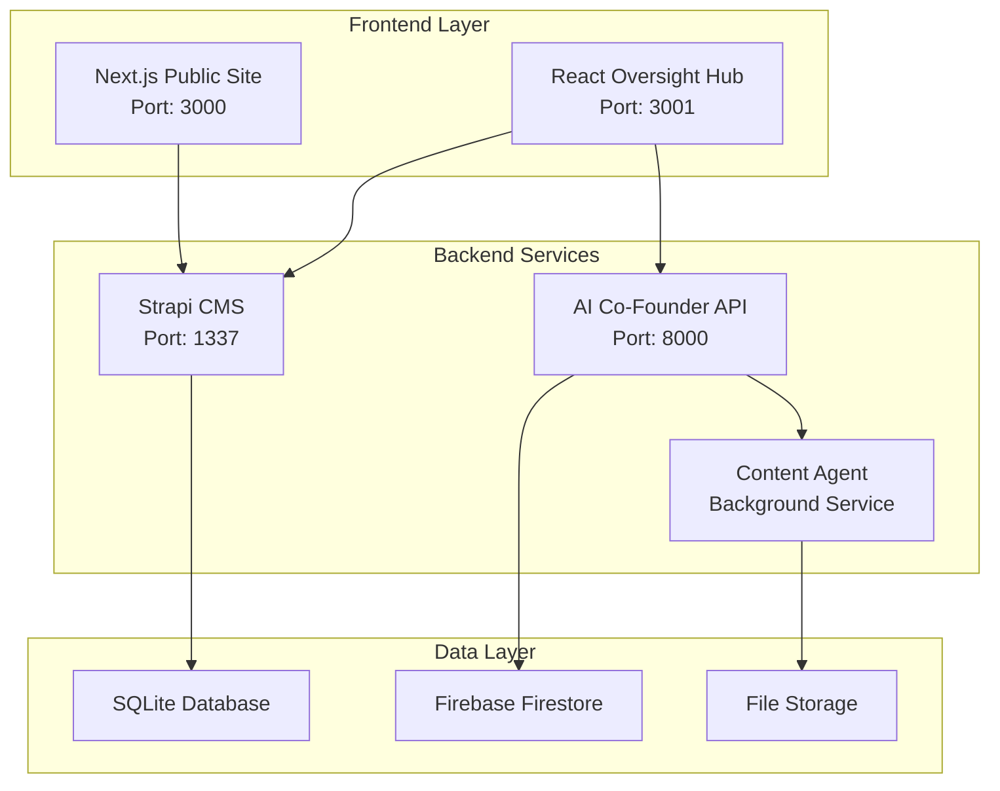

# 📋 GLAD Labs AI Co-Founder System - Developer Guide

## Table of Contents

1. [Architecture Overview](#️-architecture-overview)
2. [Development Environment](#-development-environment)
3. [Component Documentation](#-component-documentation)
4. [API References](#-api-references)
5. [Testing Guide](#-testing-guide)
6. [Deployment Guide](#-deployment-guide)

---

## 🏗️ Architecture Overview

### System Components

The GLAD Labs AI Co-Founder System is built as a modern monorepo with the following key components:



### Technology Stack

| Component     | Technology                | Version | Purpose                            |
| ------------- | ------------------------- | ------- | ---------------------------------- |
| **Frontend**  | Next.js                   | 15.1.0  | Static site generation, API routes |
| **Admin UI**  | React                     | 18.3.1  | Management dashboard               |
| **CMS**       | Strapi                    | v5      | Content management API             |
| **AI Engine** | Python                    | 3.12    | FastAPI, AI orchestration          |
| **Database**  | SQLite/Firestore          | -       | Data persistence                   |
| **AI APIs**   | OpenAI, Anthropic, Google | Latest  | AI model integrations              |

---

## 🔧 Development Environment

### Prerequisites

- **Node.js** 18+ with npm
- **Python** 3.12+ with pip
- **Git** for version control
- **VS Code** (recommended) with Python and TypeScript extensions

### Environment Setup

1. **Clone Repository**

   ```bash
   git clone <repository-url>
   cd glad-labs-website
   ```

2. **Install Dependencies**

   ```bash
   # Install all dependencies (Python + Node.js)
   npm run setup:all
   ```

3. **Environment Configuration**

   ```bash
   # Copy environment templates
   cp .env.example .env
   cp src/cofounder_agent/.env.example src/cofounder_agent/.env
   ```

4. **Configure API Keys**

   ```env
   # .env file
   OPENAI_API_KEY=your_openai_key
   ANTHROPIC_API_KEY=your_anthropic_key
   GOOGLE_AI_API_KEY=your_google_key
   ```

### Development Workflow

```bash
# Start all services in development mode
npm run dev

# Start individual services
npm run dev:public     # Next.js site
npm run dev:oversight  # React admin
npm run dev:strapi     # Strapi CMS
npm run dev:cofounder  # AI Co-Founder

# Run tests
npm test               # All tests
npm run test:frontend  # Frontend only
npm run test:python    # Python only

# Code quality
npm run lint           # Lint all code
npm run format         # Format code
```

---

## 📦 Component Documentation

### 🌐 Next.js Public Site (`web/public-site/`)

**Purpose**: Public-facing website with static generation for optimal performance.

**Key Features**:

- Server-side generation (SSG) for blog posts
- Dynamic API routes for content fetching
- SEO optimization with meta tags
- Responsive design with Tailwind CSS

**Development**:

```bash
cd web/public-site
npm run dev        # Development server
npm run build      # Production build
npm run start      # Production server
```

**File Structure**:

```text

web/public-site/
├── pages/ # Next.js pages
├── components/ # Reusable UI components
├── styles/ # CSS and Tailwind
├── lib/ # Utility functions
└── public/ # Static assets

```

### ⚛️ React Oversight Hub (`web/oversight-hub/`)

**Purpose**: Administrative interface for managing AI agents and monitoring system performance.

**Key Features**:

- Real-time monitoring dashboard
- Agent configuration interface
- Content generation controls
- System metrics and analytics

**Development**:

```bash
cd web/oversight-hub
npm start          # Development server
npm run build      # Production build
npm test           # Run tests
```

### 🎛️ Strapi CMS (`cms/strapi-v5-backend/`)

**Purpose**: Headless CMS providing RESTful APIs for content management.

**Key Features**:

- Content type management
- API endpoint generation
- Admin panel for content editing
- Plugin ecosystem support

**Development**:

```bash
cd cms/strapi-v5-backend
npm run develop    # Development mode
npm run build      # Build admin panel
npm start          # Production mode
```

### 🤖 AI Co-Founder System (`src/cofounder_agent/`)

**Purpose**: Core AI system providing business intelligence and agent orchestration.

**Key Features**:

- FastAPI web server
- Multi-agent orchestration
- Business intelligence analytics
- Voice interaction support
- Model Context Protocol (MCP) integration

**Development**:

```bash
cd src/cofounder_agent
python main.py     # Start server
python -m pytest  # Run tests
```

### 📝 Content Agent (`agents/content-agent/`)

**Purpose**: Autonomous content creation system with AI-powered research and writing.

**Key Features**:

- Automated content research
- Multi-format content generation
- SEO optimization
- Image sourcing and processing

---

## 🔌 API References

### Strapi CMS API

**Base URL**: `http://localhost:1337/api`

**Authentication**: Bearer token required for protected endpoints

**Common Endpoints**:

```http
GET    /posts              # List all posts
GET    /posts/{id}         # Get specific post
POST   /posts              # Create new post
PUT    /posts/{id}         # Update post
DELETE /posts/{id}         # Delete post
```

### AI Co-Founder API

**Base URL**: `http://localhost:8000`

**WebSocket**: Available for real-time interactions

**Key Endpoints**:

```http
GET    /health             # System health check
POST   /chat               # Chat with AI Co-Founder
POST   /analyze            # Business analysis
GET    /agents/status      # Agent status monitoring
POST   /content/generate   # Trigger content generation
```

**WebSocket Events**:

```javascript
// Connect to WebSocket
const ws = new WebSocket('ws://localhost:8000/ws');

// Listen for events
ws.onmessage = (event) => {
  const data = JSON.parse(event.data);
  console.log('Event:', data.type, data.payload);
};
```

---

## 🧪 Testing Guide

### Test Structure

```text
tests/
├── frontend/        # Frontend component tests
├── integration/     # Cross-service integration tests
├── e2e/            # End-to-end workflow tests
└── python/         # Python unit and integration tests
```

### Running Tests

```bash
# All tests
npm test

# Frontend tests (Jest + React Testing Library)
npm run test:frontend

# Python tests (pytest)
npm run test:python

# E2E tests (specific workflows)
npm run test:python:smoke
```

### Test Coverage

- **Frontend**: Component testing with Jest and React Testing Library
- **Backend**: Unit tests with pytest and async testing
- **Integration**: API endpoint testing
- **E2E**: Full workflow validation

---

## 🚀 Deployment Guide

### Production Build

```bash
# Build all components
npm run build

# Start production services
npm run start:all
```

### Docker Deployment

```bash
# Build containers
docker-compose build

# Start services
docker-compose up -d
```

### Environment Variables

**Production Environment**:

```env
NODE_ENV=production
STRAPI_URL=https://your-strapi-domain.com
AI_COFOUNDER_URL=https://your-ai-api-domain.com
DATABASE_URL=your-production-db-url
```

### Performance Optimization

1. **Static Generation**: Next.js pre-builds pages for optimal loading
2. **CDN Integration**: Static assets served via CDN
3. **Database Optimization**: Indexed queries and connection pooling
4. **Caching**: Redis caching for frequently accessed data

---

## 📚 Additional Resources

- [Architecture Documentation](../ARCHITECTURE.md)
- [Installation Guide](../INSTALLATION_SUMMARY.md)
- [Coding Standards](../GLAD_LABS_STANDARDS.md)
- [Component README Files](../README.md)

---

**Last Updated**: October 14, 2025  
**Version**: 3.0  
**Maintainer**: GLAD Labs Development Team
