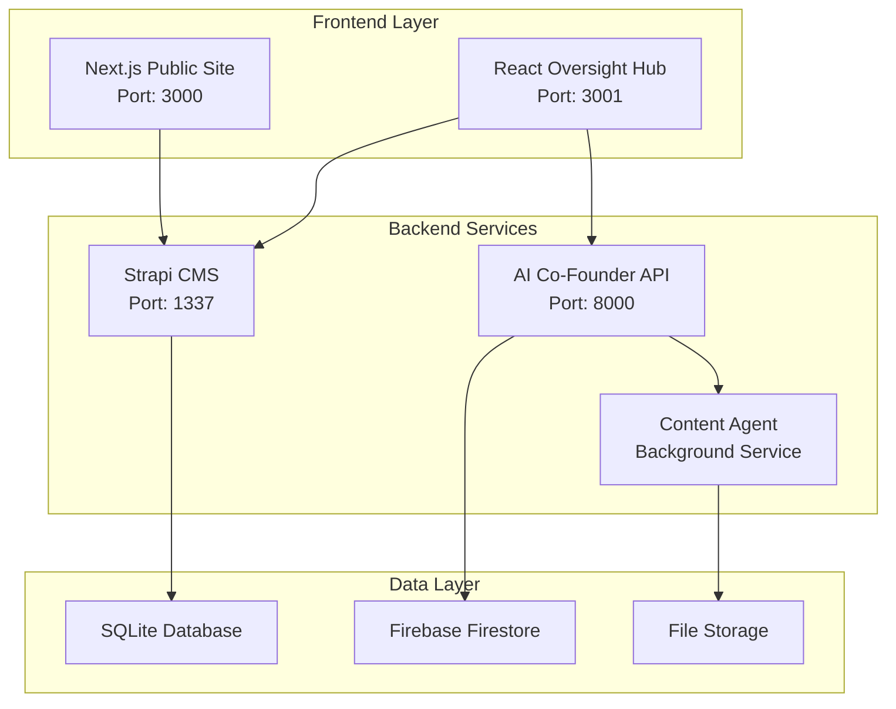

# 📋 GLAD Labs AI Co-Founder System - Developer Guide

## Table of Contents

1. [Architecture Overview](#️-architecture-overview)
2. [Development Environment](#-development-environment)
3. [Component Documentation](#-component-documentation)
4. [API References](#-api-references)
5. [Testing Guide](#-testing-guide)
6. [Deployment Guide](#-deployment-guide)

---

## 🏗️ Architecture Overview

### System Components

The GLAD Labs AI Co-Founder System is built as a modern monorepo with the following key components:



### Technology Stack

| Component     | Technology                | Version | Purpose                            |
| ------------- | ------------------------- | ------- | ---------------------------------- |
| **Frontend**  | Next.js                   | 15.1.0  | Static site generation, API routes |
| **Admin UI**  | React                     | 18.3.1  | Management dashboard               |
| **CMS**       | Strapi                    | v5      | Content management API             |
| **AI Engine** | Python                    | 3.12    | FastAPI, AI orchestration          |
| **Database**  | SQLite/Firestore          | -       | Data persistence                   |
| **AI APIs**   | OpenAI, Anthropic, Google | Latest  | AI model integrations              |

---

## 🔧 Development Environment

### Prerequisites

- **Node.js** 18+ with npm
- **Python** 3.12+ with pip
- **Git** for version control
- **VS Code** (recommended) with Python and TypeScript extensions

### Environment Setup

1. **Clone Repository**

   ```bash
   git clone <repository-url>
   cd glad-labs-website
   ```

2. **Install Dependencies**

   ```bash
   # Install all dependencies (Python + Node.js)
   npm run setup:all
   ```

3. **Environment Configuration**

   ```bash
   # Copy environment templates
   cp .env.example .env
   cp src/cofounder_agent/.env.example src/cofounder_agent/.env
   ```

4. **Configure API Keys**

   ```env
   # .env file
   OPENAI_API_KEY=your_openai_key
   ANTHROPIC_API_KEY=your_anthropic_key
   GOOGLE_AI_API_KEY=your_google_key
   ```

### Development Workflow

```bash
# Start all services in development mode
npm run dev

# Start individual services
npm run dev:public     # Next.js site
npm run dev:oversight  # React admin
npm run dev:strapi     # Strapi CMS
npm run dev:cofounder  # AI Co-Founder

# Run tests
npm test               # All tests
npm run test:frontend  # Frontend only
npm run test:python    # Python only

# Code quality
npm run lint           # Lint all code
npm run format         # Format code
```

### 🆓 Local Development with Ollama (Zero-Cost AI)

**Purpose**: Enable zero-cost local AI inference for development and testing without cloud API costs.

#### **Quick Setup**

1. **Install Ollama**

   ```bash
   # Windows (winget)
   winget install Ollama.Ollama

   # macOS (Homebrew)
   brew install ollama

   # Linux (curl)
   curl -fsSL https://ollama.ai/install.sh | sh
   ```

2. **Pull a Model**

   ```bash
   # Recommended for most development work
   ollama pull mistral

   # Alternative models
   ollama pull phi           # Smaller, faster (2.7B)
   ollama pull codellama     # Code-focused (7B-34B)
   ollama pull mixtral       # More powerful (8x7B)
   ```

3. **Enable Ollama in GLAD Labs**

   ```bash
   # PowerShell (Windows)
   $env:USE_OLLAMA = "true"

   # Bash/Linux/macOS
   export USE_OLLAMA=true

   # Or add to .env file
   echo "USE_OLLAMA=true" >> .env
   echo "OLLAMA_HOST=http://localhost:11434" >> .env
   ```

4. **Start Development**

   ```bash
   npm run dev
   # All AI requests now use local Ollama inference ($0.00 cost)
   ```

#### **OllamaClient API Reference**

```python
# src/cofounder_agent/services/ollama_client.py

from services.ollama_client import OllamaClient

# Initialize client
client = OllamaClient(host="http://localhost:11434")

# Check health
is_healthy = await client.check_health()
# Returns: True if Ollama is running

# Generate text
response = await client.generate(
    prompt="Explain quantum computing",
    model="mistral",
    temperature=0.7,
    max_tokens=500
)
# Returns: {"response": "...", "model": "mistral", "created_at": "..."}

# Chat completion
chat_response = await client.chat(
    messages=[
        {"role": "system", "content": "You are a helpful assistant."},
        {"role": "user", "content": "What is AI?"}
    ],
    model="mistral"
)
# Returns: {"message": {"role": "assistant", "content": "..."}, ...}

# Streaming generation
async for chunk in client.stream_generate(prompt, model="mistral"):
    print(chunk.get("response", ""), end="", flush=True)
# Yields: Incremental response chunks for real-time display
```

#### **ModelRouter Integration**

```python
# src/cofounder_agent/services/model_router.py

from services.model_router import ModelRouter, ModelProvider, ModelTier

# Initialize router with Ollama enabled
router = ModelRouter(use_ollama=True)

# Route request (automatically uses Ollama if enabled)
model_config = router.route_request(task_type="content_generation")
# Returns: {
#     'provider': ModelProvider.OLLAMA,
#     'tier': ModelTier.FREE,
#     'model': 'mistral',
#     'cost_per_1k_tokens': 0.00
# }

# Manual provider selection
if router.use_ollama:
    client = OllamaClient()
    response = await client.generate(prompt, model="mistral")
else:
    # Fallback to cloud API
    response = await openai_client.generate(prompt)
```

#### **Testing with Ollama**

**Unit Tests (Mocking)**:

```python
# tests/test_ollama_integration.py

import pytest
from unittest.mock import AsyncMock, patch

@pytest.mark.asyncio
async def test_ollama_generation():
    """Test Ollama client generation."""
    with patch('aiohttp.ClientSession.post') as mock_post:
        mock_post.return_value.__aenter__.return_value.json = AsyncMock(
            return_value={"response": "Test output", "model": "mistral"}
        )

        client = OllamaClient()
        result = await client.generate("Test prompt", model="mistral")

        assert result["response"] == "Test output"
        assert result["model"] == "mistral"
```

**Integration Tests (Real Ollama Server)**:

```python
# tests/integration/test_ollama_live.py

import pytest
from services.ollama_client import OllamaClient

@pytest.mark.integration
@pytest.mark.asyncio
async def test_ollama_health_check():
    """Test actual Ollama server health."""
    client = OllamaClient()
    is_healthy = await client.check_health()
    assert is_healthy, "Ollama server is not running"

@pytest.mark.integration
@pytest.mark.asyncio
async def test_ollama_real_generation():
    """Test real generation with Ollama."""
    client = OllamaClient()
    response = await client.generate(
        prompt="Say 'Hello, Ollama!' and nothing else.",
        model="mistral",
        max_tokens=10
    )
    assert "response" in response
    assert len(response["response"]) > 0
```

**Run Integration Tests**:

```bash
# Ensure Ollama is running
ollama serve

# Run integration tests
pytest tests/integration/test_ollama_live.py -v -m integration
```

#### **Performance Profiling**

**Benchmark Tokens/Second**:

```python
# scripts/benchmark_ollama.py

import asyncio
import time
from services.ollama_client import OllamaClient

async def benchmark_model(model: str, prompt: str, iterations: int = 5):
    """Benchmark Ollama model performance."""
    client = OllamaClient()

    total_tokens = 0
    total_time = 0

    for i in range(iterations):
        start = time.time()
        response = await client.generate(prompt, model=model)
        elapsed = time.time() - start

        tokens = len(response["response"].split())
        total_tokens += tokens
        total_time += elapsed

        print(f"Iteration {i+1}: {tokens} tokens in {elapsed:.2f}s ({tokens/elapsed:.1f} tokens/sec)")

    avg_tps = total_tokens / total_time
    print(f"\n{model} Average: {avg_tps:.1f} tokens/sec")
    return avg_tps

# Run benchmark
asyncio.run(benchmark_model("mistral", "Explain AI in 200 words"))
```

**Monitor GPU Usage**:

```bash
# NVIDIA GPU
nvidia-smi -l 1

# AMD GPU
rocm-smi

# macOS (Apple Silicon)
sudo powermetrics --samplers gpu_power -i 1000
```

#### **Troubleshooting Development Issues**

| Issue                                       | Solution                                                                                                  |
| ------------------------------------------- | --------------------------------------------------------------------------------------------------------- |
| **"Connection refused" on localhost:11434** | Start Ollama: `ollama serve`                                                                              |
| **GLAD Labs still using OpenAI**            | Verify `USE_OLLAMA=true` in environment: `echo $env:USE_OLLAMA` (PowerShell) or `echo $USE_OLLAMA` (Bash) |
| **"Model not found" error**                 | Pull model: `ollama pull mistral`                                                                         |
| **Slow generation (< 10 tokens/sec)**       | Check GPU availability: `ollama list` shows models, ensure GPU drivers installed                          |
| **High memory usage**                       | Use smaller model (phi instead of mixtral) or close other applications                                    |
| **Import errors in Python**                 | Reinstall dependencies: `pip install -r src/cofounder_agent/requirements.txt`                             |

#### **Cost Comparison (Development)**

| Scenario                         | Ollama (Local) | OpenAI (Cloud) | Monthly Savings |
| -------------------------------- | -------------- | -------------- | --------------- |
| **Light Dev** (10K tokens/day)   | $0.00          | $0.75          | $0.75           |
| **Active Dev** (100K tokens/day) | $0.00          | $7.50          | $7.50           |
| **Heavy Dev** (1M tokens/day)    | $0.00          | $75.00         | $75.00          |

**ROI for Development Teams**:

- 5 developers × $75/month saved = **$375/month** = **$4,500/year**
- Plus: 100% privacy, offline capability, no API rate limits

#### **Best Practices**

1. **Start with Ollama for All Development**
   - Zero cost for rapid iteration
   - Test and validate features locally
   - Switch to cloud APIs only for production deployment

2. **Model Selection Strategy**
   - **Quick tests**: Use `phi` (2.7B) - fastest inference
   - **General development**: Use `mistral` (7B) - best balance
   - **Code generation**: Use `codellama` (7B-34B) - code-optimized
   - **Complex logic**: Use `mixtral` (8x7B) - highest quality

3. **Preload Models**

   ```bash
   # Preload frequently used models
   ollama pull phi
   ollama pull mistral
   ollama pull codellama
   ```

4. **Monitor Resources**

   ```bash
   # Check loaded models
   ollama list

   # Monitor Ollama logs
   ollama logs
   ```

5. **Hybrid Development Strategy**
   ```python
   # Use Ollama for development, cloud for validation
   if os.getenv('ENVIRONMENT') == 'development':
       os.environ['USE_OLLAMA'] = 'true'
   else:
       os.environ['USE_OLLAMA'] = 'false'
   ```

#### **Additional Resources**

- **Comprehensive Guide**: [docs/OLLAMA_SETUP.md](./OLLAMA_SETUP.md)
- **Official Docs**: https://ollama.ai/docs
- **Model Library**: https://ollama.ai/library
- **GitHub**: https://github.com/ollama/ollama

---

## 📦 Component Documentation

### 🌐 Next.js Public Site (`web/public-site/`)

**Purpose**: Public-facing website with static generation for optimal performance.

**Key Features**:

- Server-side generation (SSG) for blog posts
- Dynamic API routes for content fetching
- SEO optimization with meta tags
- Responsive design with Tailwind CSS

**Development**:

```bash
cd web/public-site
npm run dev        # Development server
npm run build      # Production build
npm run start      # Production server
```

**File Structure**:

```text

web/public-site/
├── pages/ # Next.js pages
├── components/ # Reusable UI components
├── styles/ # CSS and Tailwind
├── lib/ # Utility functions
└── public/ # Static assets

```

### ⚛️ React Oversight Hub (`web/oversight-hub/`)

**Purpose**: Administrative interface for managing AI agents and monitoring system performance.

**Key Features**:

- Real-time monitoring dashboard
- Agent configuration interface
- Content generation controls
- System metrics and analytics

**Development**:

```bash
cd web/oversight-hub
npm start          # Development server
npm run build      # Production build
npm test           # Run tests
```

### 🎛️ Strapi CMS (`cms/strapi-v5-backend/`)

**Purpose**: Headless CMS providing RESTful APIs for content management.

**Key Features**:

- Content type management
- API endpoint generation
- Admin panel for content editing
- Plugin ecosystem support

**Development**:

```bash
cd cms/strapi-v5-backend
npm run develop    # Development mode
npm run build      # Build admin panel
npm start          # Production mode
```

### 🤖 AI Co-Founder System (`src/cofounder_agent/`)

**Purpose**: Core AI system providing business intelligence and agent orchestration.

**Key Features**:

- FastAPI web server
- Multi-agent orchestration
- Business intelligence analytics
- Voice interaction support
- Model Context Protocol (MCP) integration

**Development**:

```bash
cd src/cofounder_agent
python main.py     # Start server
python -m pytest  # Run tests
```

### 📝 Content Agent (`src/agents/content_agent/`)

Note: The production task runner currently references `agents/content-agent/` for the live agent process. The unit tests and newer modules live under `src/agents/content_agent/`. We recommend consolidating to a single location; until then, prefer `src/agents/content_agent/` for development and tests, and use the workspace task for starting the live agent.

**Purpose**: Autonomous content creation system with AI-powered research and writing.

**Key Features**:

- Automated content research
- Multi-format content generation
- SEO optimization
- Image sourcing and processing

---

## 🔌 API References

### Strapi CMS API

**Base URL**: `http://localhost:1337/api`

**Authentication**: Bearer token required for protected endpoints

**Common Endpoints**:

```http
GET    /posts              # List all posts
GET    /posts/{id}         # Get specific post
POST   /posts              # Create new post
PUT    /posts/{id}         # Update post
DELETE /posts/{id}         # Delete post
```

### AI Co-Founder API

**Base URL**: `http://localhost:8000`

**WebSocket**: Available for real-time interactions

**Key Endpoints**:

```http
GET    /health             # System health check
POST   /chat               # Chat with AI Co-Founder
POST   /analyze            # Business analysis
GET    /agents/status      # Agent status monitoring
POST   /content/generate   # Trigger content generation
```

**WebSocket Events**:

```javascript
// Connect to WebSocket
const ws = new WebSocket('ws://localhost:8000/ws');

// Listen for events
ws.onmessage = (event) => {
  const data = JSON.parse(event.data);
  console.log('Event:', data.type, data.payload);
};
```

---

## 🧪 Testing Guide

### Test Structure

```text
tests/
├── frontend/        # Frontend component tests
├── integration/     # Cross-service integration tests
├── e2e/            # End-to-end workflow tests
└── python/         # Python unit and integration tests
```

### Running Tests

```bash
# All tests
npm test

# Frontend tests (Jest + React Testing Library)
npm run test:frontend

# Python tests (pytest)
npm run test:python

# E2E tests (specific workflows)
npm run test:python:smoke
```

### Test Coverage

- **Frontend**: Component testing with Jest and React Testing Library
- **Backend**: Unit tests with pytest and async testing
- **Integration**: API endpoint testing
- **E2E**: Full workflow validation

---

## 🚀 Deployment Guide

### Production Build

```bash
# Build all components
npm run build

# Start production services
npm run start:all
```

### Docker Deployment

```bash
# Build containers
docker-compose build

# Start services
docker-compose up -d
```

### Environment Variables

**Production Environment**:

```env
NODE_ENV=production
STRAPI_URL=https://your-strapi-domain.com
AI_COFOUNDER_URL=https://your-ai-api-domain.com
DATABASE_URL=your-production-db-url
```

### Performance Optimization

1. **Static Generation**: Next.js pre-builds pages for optimal loading
2. **CDN Integration**: Static assets served via CDN
3. **Database Optimization**: Indexed queries and connection pooling
4. **Caching**: Redis caching for frequently accessed data

---

## 📚 Additional Resources

- [Architecture Documentation](./ARCHITECTURE.md)
- [Installation Guide](./INSTALLATION_SUMMARY.md)
- [Coding Standards](./GLAD-LABS-STANDARDS.md)
- [Component README Files](../README.md)

---

**Last Updated**: October 14, 2025  
**Version**: 3.0  
**Maintainer**: GLAD Labs Development Team
