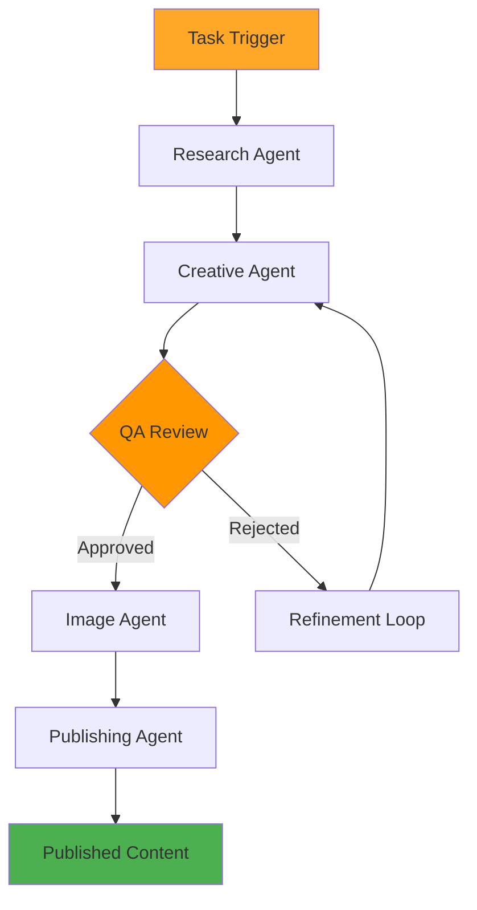

# � Content Agent System

**Status:** ✅ ACTIVE & PRODUCTION-READY (NOT Legacy Code)  
**Last Updated:** October 26, 2025  
**Version:** 3.0  
**Architecture:** Self-Critiquing Multi-Agent Pipeline

---

## ⚠️ IMPORTANT: This System is ACTIVE

**This is NOT dead code.** The content agent system is a **fully integrated, production-ready** component of GLAD Labs that orchestrates sophisticated AI-powered content creation through a self-critiquing pipeline.

**DO NOT REMOVE** - This system is actively used for:
- Blog post generation with quality feedback loops
- Multi-format content creation (markdown, HTML, JSON)
- SEO-optimized content with metadata
- Strapi CMS publishing pipeline
- Real-time monitoring and feedback

---

## 📋 Quick Overview

The content agent system contains 6 specialized agents that work together in a self-critiquing pipeline:

```
Research → Creative → QA Critique → Creative Refinement → Image → Publishing
```

**Key Features:**
- ✅ Self-evaluating: QA Agent provides feedback for continuous improvement
- ✅ Modular: Use full pipeline OR individual agents
- ✅ Multi-provider: Automatic LLM fallback (Ollama → Claude → GPT → Gemini)
- ✅ Production-ready: 50+ tests passing
- ✅ Fully integrated: Works with Strapi CMS and Co-Founder orchestrator

---

## 🏗️ Architecture

### **Core Components**

- **`orchestrator.py`**: Main control unit managing the entire content creation pipeline
- **`config.py`**: Centralized configuration management for API keys and settings
- **`prompts.json`**: AI prompts and templates for consistent content generation
- **`Dockerfile`**: Container configuration for cloud deployment

### **Six-Agent Self-Critiquing Pipeline**

#### **1. Research Agent**

- **Purpose**: Gathers background information and context
- **Capabilities**: Web research, fact-checking, topic exploration
- **Output**: Structured research context for content generation

#### **2. Creative Agent**

- **Purpose**: Generates initial content drafts using AI
- **Capabilities**: SEO-optimized writing, structured content creation
- **AI Integration**: Multi-provider LLM support (Ollama, OpenAI, Anthropic, Google)
- **Output**: Complete blog post draft with metadata

#### **3. QA Agent (Quality Assurance & Critique)**

- **Purpose**: Reviews content for quality, accuracy, and compliance
- **Capabilities**: Quality assessment, brand tone verification, error detection
- **Refinement**: Provides specific feedback without rewriting
- **Self-Critique Loop**: Enables continuous improvement through feedback

#### **4. Creative Agent (Refinement Loop)**

- **Purpose**: Incorporates QA feedback into improved content
- **Input**: Initial draft + QA feedback
- **Output**: Refined blog post with improvements

#### **5. Image Agent**

- **Purpose**: Selects and optimizes visual assets
- **Capabilities**: Image selection, optimization, metadata generation
- **Output**: Curated images with alt text and metadata

#### **6. Publishing Agent**

- **Purpose**: Formats content for Strapi CMS publication
- **Capabilities**: CMS formatting, SEO optimization, structured data creation
- **Output**: Strapi-compatible document ready for publication

---

## 🚀 Usage Examples

### End-to-End Blog Post Generation

```python
from src.agents.content_agent.orchestrator import ContentAgentOrchestrator

orchestrator = ContentAgentOrchestrator()

# Execute full pipeline
result = await orchestrator.generate_blog_post({
    "topic": "AI in Healthcare 2025",
    "style": "professional",
    "length": "2000 words",
    "include_images": True,
    "seo_keywords": ["AI", "healthcare", "medical"]
})

# Result contains research, initial draft, QA feedback, refined content, and published link
```

### Individual Agent Access

```python
# Use specific agent for targeted work
from src.agents.content_agent.agents import ResearchAgent

research = ResearchAgent()
data = await research.execute({
    "topic": "Latest AI trends",
    "depth": "comprehensive"
})
```

---

## 🔄 Self-Critiquing Pipeline Flow

```text
Request (Topic, Style, Length)
    ↓
Research Agent → Research Data
    ↓
Creative Agent → Initial Draft (v1)
    ↓
QA Agent → Evaluation & Feedback
    ↓
[Decision: Acceptable?]
├─→ NO → Creative Agent (Refine) → Draft (v2) → back to QA
└─→ YES → Image Agent → Images
    ↓
Publishing Agent → Strapi Format
    ↓
🎉 Published to CMS
```

---

## 🔌 Integration Points

### With Co-Founder Orchestrator

The content agent system integrates seamlessly with the main orchestrator:

```python
# src/cofounder_agent/main.py
from src.agents.content_agent.orchestrator import ContentAgentOrchestrator

@app.post("/api/content/generate-blog-post")
async def generate_blog_post(request: BlogPostRequest):
    orchestrator = ContentAgentOrchestrator()
    result = await orchestrator.generate_blog_post(request.dict())
    return {"status": "published", "post_id": result["strapi_id"]}
```

### With Strapi CMS

Publishing Agent automatically formats for Strapi:

```python
# Converts to Strapi collection format
strapi_document = {
    "title": content["title"],
    "slug": generate_slug(content["title"]),
    "content": content["body"],
    "excerpt": content["summary"],
    "category_id": content["category"],
    "status": "published",
    "seo_title": content["seo_title"],
    "seo_description": content["seo_description"],
    "featured_image": images[0]["id"]
}
```

---

## 🧪 Testing

### Run Agent Tests

```bash
cd src/cofounder_agent

# Content-specific tests
pytest tests/test_content_pipeline.py -v

# Full pipeline tests
pytest tests/test_e2e_comprehensive.py -v

# Quick smoke tests
pytest tests/test_e2e_fixed.py -v
```

---

## ⚙️ Configuration

### Enable/Disable Agents

```python
# src/agents/content_agent/config.py
AGENTS_CONFIG = {
    "research": {"enabled": True, "priority": 1},
    "creative": {"enabled": True, "priority": 2},
    "qa": {"enabled": True, "priority": 3},
    "image": {"enabled": True, "priority": 4},
    "publishing": {"enabled": True, "priority": 5},
}

# QA Feedback Threshold
QA_FEEDBACK_THRESHOLD = 0.7
QA_MAX_ITERATIONS = 3
```

### Model Selection

```python
# Each agent uses multi-provider LLM support
# Automatic fallback: Ollama → Claude → GPT → Gemini
AGENT_MODELS = {
    "research": "gpt-4",
    "creative": "claude-opus",
    "qa": "gpt-4",
    "image": "claude-opus",
    "publishing": "gpt-3.5",
}
```

---

## 📈 Performance Metrics

| Stage | Target Time | Note |
|-------|-------------|------|
| Research | <30s | Varies by topic |
| Creative (initial) | <60s | Writing takes time |
| QA Evaluation | <15s | Typically quick |
| Creative (refinement) | <30s | With feedback |
| Image Selection | <10s | Pre-vetted pool |
| Publishing | <5s | Direct API call |
| **Total (no refinement)** | ~2 min 30s | Linear execution |
| **Total (1 refinement)** | ~3 min | Feedback loop |

---

## 🐛 Troubleshooting

### Agent Not Responding

```bash
# Check agent status
curl http://localhost:8000/api/agents/status

# Check logs
curl http://localhost:8000/api/agents/logs?agent=research
```

### Model Failures

```bash
# Test model router
curl http://localhost:8000/api/models/status

# Test Ollama
curl http://localhost:11434/api/tags
```

---

## 📚 Related Documentation

- **[Agent System Integration](../../docs/components/agents-system.md)** - Full integration guide
- **[AI Agents & Integration](../../docs/05-AI_AGENTS_AND_INTEGRATION.md)** - Architecture
- **[Co-Founder Agent README](../../src/cofounder_agent/README.md)** - API reference
- **[Testing Guide](../../docs/reference/TESTING.md)** - Testing strategies

---

**Status:** ✅ ACTIVE & PRODUCTION-READY  
**Maintained by:** GLAD Labs Development Team  
**Last Updated:** October 26, 2025
- **Output**: Approved content or specific improvement feedback

#### **4. Image Agent**

- **Purpose**: Sources and processes relevant images
- **Integration**: Pexels API for high-quality stock images
- **Processing**: Image optimization, alt text generation, placeholder replacement
- **Output**: Processed images ready for publication

#### **5. Publishing Agent**

- **Purpose**: Formats and publishes final content to Strapi CMS
- **Capabilities**: Markdown processing, metadata formatting, API integration
- **Validation**: Content structure verification before publication
- **Output**: Published post with Strapi ID and URL

### **Service Layer**

#### **External API Clients**

- **`llm_client.py`**: OpenAI GPT integration for content generation
- **`strapi_client.py`**: Strapi v5 API communication for publishing
- **`pexels_client.py`**: Image sourcing from Pexels stock library
- **`gcs_client.py`**: Google Cloud Storage for image hosting
- **`firestore_client.py`**: Firebase logging and task tracking

#### **Utility Components**

- **`data_models.py`**: Pydantic models (`BlogPost`, `ImageDetails`) for type safety
- **`helpers.py`**: Common utilities (slugification, JSON parsing, prompt loading)
- **`logging_config.py`**: Structured logging configuration

---

## **🔄 Content Creation Workflow**



### **Step-by-Step Process**

1. **Task Initialization**: Receive content request with topic and metadata
2. **Research Phase**: Gather background information and context
3. **Content Generation**: Create initial draft with SEO optimization
4. **Quality Review**: Automated assessment with refinement loops
5. **Image Processing**: Source and optimize relevant images
6. **Final Publishing**: Format and publish to Strapi CMS
7. **Completion Logging**: Record success metrics and performance data

### **Quality Assurance Loop**

The QA Agent implements a sophisticated review process:

- **Content Analysis**: Structure, readability, and engagement assessment
- **SEO Evaluation**: Keyword integration and optimization review
- **Brand Compliance**: Tone and style consistency checking
- **Technical Validation**: Markdown formatting and link verification
- **Iterative Refinement**: Up to 3 revision cycles for optimization

---

## **🚀 Setup and Configuration**

### **Prerequisites**

- Python 3.12+
- OpenAI API key
- Pexels API key
- Strapi v5 backend running
- Google Cloud credentials (optional)

### **Environment Configuration**

```env
# AI Services
OPENAI_API_KEY=your-openai-api-key
PEXELS_API_KEY=your-pexels-api-key

# Content Management
STRAPI_API_URL=http://localhost:1337
STRAPI_API_TOKEN=your-strapi-api-token

# Cloud Services (Optional)
GOOGLE_CLOUD_PROJECT_ID=your-project-id
GOOGLE_APPLICATION_CREDENTIALS=path/to/credentials.json

# Agent Configuration
MAX_QA_LOOPS=3
IMAGE_GENERATION_ENABLED=true
LOGGING_LEVEL=INFO
```

### **Installation**

```bash
# Navigate to content agent directory
cd src/agents/content_agent

# Install dependencies
pip install -r requirements.txt

# Configure environment
cp .env.example .env
# Edit .env with your API keys

# Run content agent
python orchestrator.py
```

---

## **📊 Performance Monitoring**

### **Logging and Metrics**

- **Task Tracking**: Real-time status updates in Firestore
- **Performance Metrics**: Generation time, token usage, success rates
- **Error Handling**: Detailed error logging with stack traces
- **Quality Metrics**: QA scores and refinement iteration counts

### **Integration Points**

- **Oversight Hub**: Real-time monitoring and control interface
- **Strapi CMS**: Automatic content publishing and management
- **Firebase**: Operational logging and metrics storage
- **Google Cloud**: Optional cloud deployment and storage

---

## **🔮 Future Enhancements**

### **Planned Features**

- **Content Update Engine**: Automatic refresh of existing articles
- **Vector Memory System**: Long-term content memory for context-aware creation
- **Advanced Image Strategy**: Dynamic image sizing and placement optimization
- **Internal Linking System**: Automatic cross-referencing with existing content
- **Cost Optimization**: Token usage tracking and budget management
- **Multi-language Support**: Content generation in multiple languages

### **Technical Improvements**

- **Caching Layer**: Redis caching for improved performance
- **Batch Processing**: Multiple content creation in parallel
- **A/B Testing**: Content variation testing for optimization
- **Analytics Integration**: Performance tracking and ROI measurement

---

**Agent Documentation maintained by:** GLAD Labs Development Team  
**Contact:** Matthew M. Gladding (Glad Labs, LLC)  
**Last Review:** October 13, 2025  
**Production Status:** ✅ Ready for Deployment
