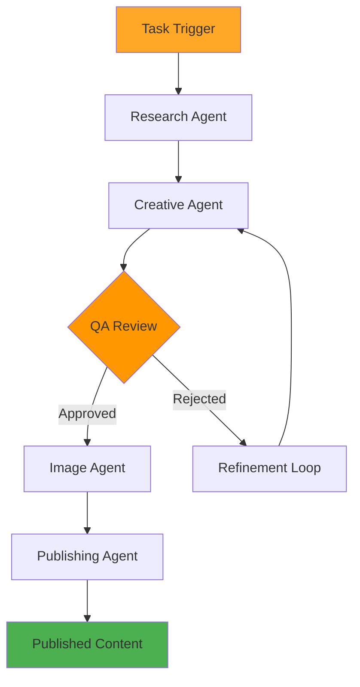

# 🤖 **GLAD Labs: Autonomous AI Content Agent v2.0**


> **Fully autonomous AI-powered content creation system that researches, generates, reviews, and publishes high-quality blog posts through a sophisticated multi-agent pipeline.**

---

## **🎯 Overview**

The Content Agent is a sophisticated AI system that autonomously creates and publishes high-quality blog content. It orchestrates multiple specialized agents through a complete content lifecycle, from initial research to final publication, ensuring consistent quality and brand alignment.

**Status:** ✅ Production Ready  
**Version:** 2.0  
**Last Updated:** October 13, 2025

---

## **🏗️ Architecture**

### **Core Components**

- **`orchestrator.py`**: Main control unit managing the entire content creation pipeline
- **`config.py`**: Centralized configuration management for API keys and settings
- **`prompts.json`**: AI prompts and templates for consistent content generation
- **`Dockerfile`**: Container configuration for cloud deployment

### **Multi-Agent Pipeline**

#### **1. Research Agent**

- **Purpose**: Gathers background information and context
- **Capabilities**: Web research, fact-checking, topic exploration
- **Output**: Structured research context for content generation

#### **2. Creative Agent**

- **Purpose**: Generates initial content drafts using AI
- **Capabilities**: SEO-optimized writing, structured content creation
- **AI Integration**: OpenAI GPT for high-quality content generation
- **Output**: Complete blog post draft with metadata

#### **3. QA Agent**

- **Purpose**: Reviews content for quality, accuracy, and compliance
- **Capabilities**: Quality assessment, brand tone verification, error detection
- **Refinement**: Multiple review cycles until content meets standards
- **Output**: Approved content or specific improvement feedback

#### **4. Image Agent**

- **Purpose**: Sources and processes relevant images
- **Integration**: Pexels API for high-quality stock images
- **Processing**: Image optimization, alt text generation, placeholder replacement
- **Output**: Processed images ready for publication

#### **5. Publishing Agent**

- **Purpose**: Formats and publishes final content to Strapi CMS
- **Capabilities**: Markdown processing, metadata formatting, API integration
- **Validation**: Content structure verification before publication
- **Output**: Published post with Strapi ID and URL

### **Service Layer**

#### **External API Clients**

- **`llm_client.py`**: OpenAI GPT integration for content generation
- **`strapi_client.py`**: Strapi v5 API communication for publishing
- **`pexels_client.py`**: Image sourcing from Pexels stock library
- **`gcs_client.py`**: Google Cloud Storage for image hosting
- **`firestore_client.py`**: Firebase logging and task tracking

#### **Utility Components**

- **`data_models.py`**: Pydantic models (`BlogPost`, `ImageDetails`) for type safety
- **`helpers.py`**: Common utilities (slugification, JSON parsing, prompt loading)
- **`logging_config.py`**: Structured logging configuration

---

## **🔄 Content Creation Workflow**



### **Step-by-Step Process**

1. **Task Initialization**: Receive content request with topic and metadata
2. **Research Phase**: Gather background information and context
3. **Content Generation**: Create initial draft with SEO optimization
4. **Quality Review**: Automated assessment with refinement loops
5. **Image Processing**: Source and optimize relevant images
6. **Final Publishing**: Format and publish to Strapi CMS
7. **Completion Logging**: Record success metrics and performance data

### **Quality Assurance Loop**

The QA Agent implements a sophisticated review process:

- **Content Analysis**: Structure, readability, and engagement assessment
- **SEO Evaluation**: Keyword integration and optimization review
- **Brand Compliance**: Tone and style consistency checking
- **Technical Validation**: Markdown formatting and link verification
- **Iterative Refinement**: Up to 3 revision cycles for optimization

---

## **🚀 Setup and Configuration**

### **Prerequisites**

- Python 3.12+
- OpenAI API key
- Pexels API key
- Strapi v5 backend running
- Google Cloud credentials (optional)

### **Environment Configuration**

```env
# AI Services
OPENAI_API_KEY=your-openai-api-key
PEXELS_API_KEY=your-pexels-api-key

# Content Management
STRAPI_API_URL=http://localhost:1337
STRAPI_API_TOKEN=your-strapi-api-token

# Cloud Services (Optional)
GOOGLE_CLOUD_PROJECT_ID=your-project-id
GOOGLE_APPLICATION_CREDENTIALS=path/to/credentials.json

# Agent Configuration
MAX_QA_LOOPS=3
IMAGE_GENERATION_ENABLED=true
LOGGING_LEVEL=INFO
```

### **Installation**

```bash
# Navigate to content agent directory
cd src/agents/content_agent

# Install dependencies
pip install -r requirements.txt

# Configure environment
cp .env.example .env
# Edit .env with your API keys

# Run content agent
python orchestrator.py
```

---

## **📊 Performance Monitoring**

### **Logging and Metrics**

- **Task Tracking**: Real-time status updates in Firestore
- **Performance Metrics**: Generation time, token usage, success rates
- **Error Handling**: Detailed error logging with stack traces
- **Quality Metrics**: QA scores and refinement iteration counts

### **Integration Points**

- **Oversight Hub**: Real-time monitoring and control interface
- **Strapi CMS**: Automatic content publishing and management
- **Firebase**: Operational logging and metrics storage
- **Google Cloud**: Optional cloud deployment and storage

---

## **🔮 Future Enhancements**

### **Planned Features**

- **Content Update Engine**: Automatic refresh of existing articles
- **Vector Memory System**: Long-term content memory for context-aware creation
- **Advanced Image Strategy**: Dynamic image sizing and placement optimization
- **Internal Linking System**: Automatic cross-referencing with existing content
- **Cost Optimization**: Token usage tracking and budget management
- **Multi-language Support**: Content generation in multiple languages

### **Technical Improvements**

- **Caching Layer**: Redis caching for improved performance
- **Batch Processing**: Multiple content creation in parallel
- **A/B Testing**: Content variation testing for optimization
- **Analytics Integration**: Performance tracking and ROI measurement

---

**Agent Documentation maintained by:** GLAD Labs Development Team  
**Contact:** Matthew M. Gladding (Glad Labs, LLC)  
**Last Review:** October 13, 2025  
**Production Status:** ✅ Ready for Deployment
