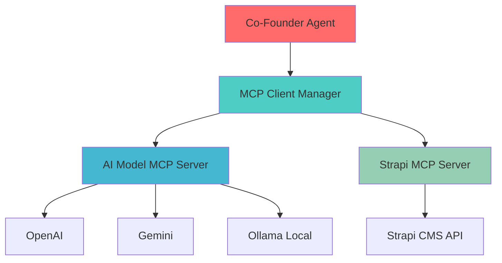

# MCP Integration Setup for GLAD Labs

## Overview

This implementation adds Model Context Protocol (MCP) integration to your GLAD Labs platform, providing:

1. **Flexible AI Model Selection** - Choose between OpenAI, Google Gemini, and local Ollama models
2. **Cost Optimization** - Automatic model selection based on cost tiers
3. **Standardized Tool Access** - Unified interface for content management and AI operations
4. **Dynamic Capability Discovery** - Runtime discovery of available tools and resources

## Installation

### 1. Install Required Python Packages

```bash
# From the project root directory
pip install mcp>=1.0.0 ollama>=0.3.0

# Or install from requirements.txt (already updated)
pip install -r requirements.txt
```

### 2. Set Up Ollama (Optional - for local models)

```bash
# Install Ollama on Windows
# Download from: https://ollama.ai/download/windows

# After installation, pull some models:
ollama pull llama3.2:1b      # Ultra cheap tier
ollama pull llama3.2:3b      # Cheap tier
ollama pull llama3.1:8b      # Balanced tier
ollama pull mistral:7b       # Alternative balanced model
```

### 3. Environment Variables

Add these to your `.env` files:

```env
# AI Model Providers
OPENAI_API_KEY=your-openai-api-key
GEMINI_API_KEY=your-gemini-api-key

# Existing Strapi configuration
STRAPI_API_URL=http://localhost:1337
STRAPI_API_TOKEN=your-strapi-api-token

# Optional: Local model preferences
LLM_PROVIDER=gemini  # or "openai", "ollama"
```

## Usage

### 1. Test MCP Implementation

```bash
# Run the test suite
cd src/mcp
python test_mcp.py
```

### 2. Use Enhanced Co-Founder Agent

The co-founder agent now supports MCP-enhanced commands:

```python
# Content creation with cost optimization
"Create content about AI in healthcare using cheap models"

# Model information
"What AI models are available?"

# Cost-optimized content
"Generate budget-friendly content about automation"

# MCP status
"Show MCP capabilities and status"
```

### 3. Direct MCP Orchestrator Usage

```python
from src.mcp.mcp_orchestrator import MCPContentOrchestrator

orchestrator = MCPContentOrchestrator()
await orchestrator.initialize()

# Generate content with specific cost tier
result = await orchestrator.generate_content_with_model_selection(
    topic="Benefits of AI automation",
    cost_tier="cheap"  # ultra_cheap, cheap, balanced, premium, ultra_premium
)

# Full content creation workflow
result = await orchestrator.research_and_create_post(
    topic="Future of AI in business",
    target_audience="business professionals",
    category="ai-insights",
    tags=["ai", "business", "automation"]
)
```

## Cost Tiers and Model Selection

### Cost Tier Strategy

- **ultra_cheap**: Local Ollama models (free) or cheapest cloud models
- **cheap**: Fast, cost-efficient models (Gemini Flash, GPT-4o-mini)
- **balanced**: Performance/cost balance (Gemini Pro, GPT-4o)
- **premium**: High performance models
- **ultra_premium**: Best available models (o1-preview)

### Model Priorities

1. **Development**: Ollama local models (free)
2. **Production**: Gemini models (cost-effective)
3. **Fallback**: OpenAI models
4. **Automatic**: Best available model for requested tier

## Architecture



## File Structure

```
src/mcp/
├── __init__.py                 # MCP module initialization
├── base_server.py             # Base MCP server class (future use)
├── client_manager.py          # MCP client management
├── mcp_orchestrator.py        # Enhanced content orchestrator
├── test_mcp.py               # Test suite
└── servers/
    ├── ai_model_server.py     # AI model access server
    └── strapi_server.py       # Strapi CMS integration server
```

## Enhanced Co-Founder Integration

The co-founder agent (`src/cofounder_agent/mcp_integration.py`) now includes:

- **MCP-Enhanced Commands**: Automatic routing to MCP capabilities
- **Cost Optimization**: Smart model selection based on request type
- **Fallback Support**: Graceful degradation to original methods
- **Enhanced Status**: Comprehensive status including MCP capabilities

## Benefits

### 1. Cost Optimization

- Automatic selection of cheapest suitable model
- Local model support for development (free)
- Token usage and cost tracking

### 2. Flexibility

- Switch between providers without code changes
- Per-request model selection
- Dynamic capability discovery

### 3. Maintainability

- Standardized tool interface across all services
- Reduced coupling between components
- Easy integration of new services

### 4. Production Ready

- Robust error handling and fallbacks
- Comprehensive logging and monitoring
- Graceful degradation when services unavailable

## Troubleshooting

### Common Issues

1. **MCP Package Not Found**

   ```bash
   pip install mcp>=1.0.0
   ```

2. **Ollama Connection Failed**

   - Ensure Ollama is installed and running
   - Try `ollama list` to verify installation

3. **Strapi Connection Failed**

   - Ensure Strapi is running on port 1337
   - Check STRAPI_API_TOKEN is valid

4. **No Models Available**
   - Set up at least one API key (OpenAI or Gemini)
   - Or install Ollama for local models

### Testing

```bash
# Test individual components
cd src/mcp
python -c "
import asyncio
from servers.ai_model_server import AIModelServer

async def test():
    server = AIModelServer()
    models = await server.get_available_models()
    print(f'Available models: {models.get(\"total_models\", 0)}')

asyncio.run(test())
"
```

## Next Steps

1. **Run Tests**: Execute `python src/mcp/test_mcp.py`
2. **Configure Models**: Set up API keys for desired providers
3. **Test Integration**: Try enhanced co-founder agent commands
4. **Monitor Costs**: Use MCP usage statistics to track spending
5. **Extend**: Add new MCP servers for additional services

The MCP integration provides a solid foundation for scalable AI operations while maintaining cost efficiency and flexibility.
